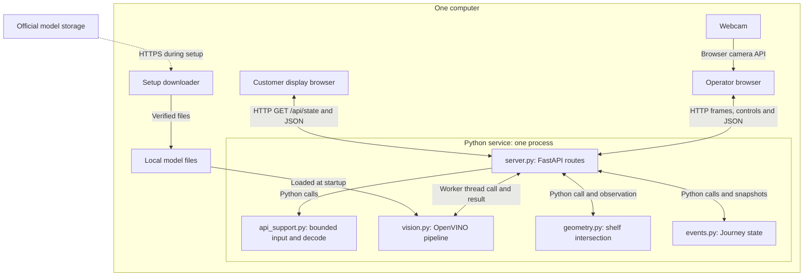
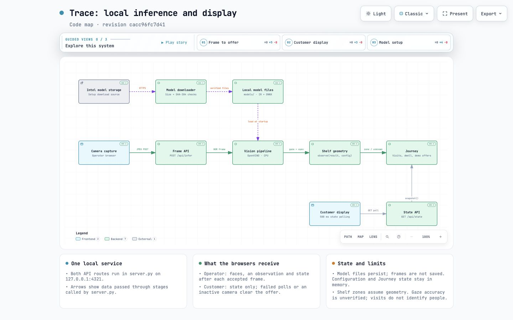
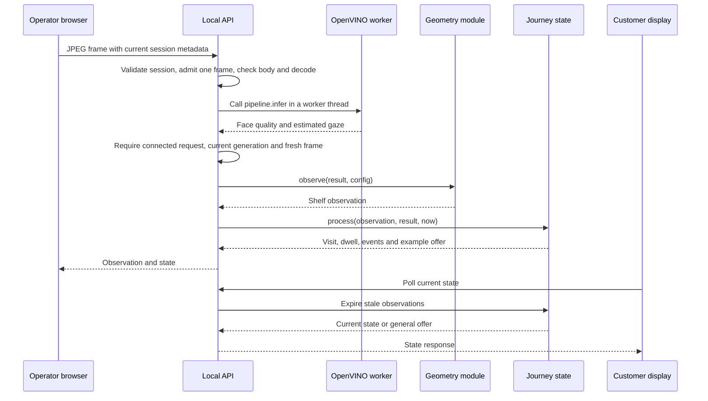

# System architecture: Trace

## Overview

Trace is a local, single-process webcam application. A browser captures images, a Python service estimates gaze using OpenVINO, and a small state machine measures continuous gaze towards three configured shelf zones. A second browser view displays example offers.

The experiment is intended for a single visible visitor at a fixed shelf. The system does not identify returning shoppers, recognise products, confirm purchases or establish a person's intent. To keep the prototype small and easy to inspect, it accepts limits in physical accuracy and multi-person tracking. It runs without a paid inference API.

For installation and operator instructions, start with the [README](README.md). This guide describes the current code and its boundaries.

## Contents

- [Key requirements](#key-requirements)
- [Process and module boundaries](#process-and-module-boundaries)
- [Component details](#component-details)
- [Frame and control lifecycle](#frame-and-control-lifecycle)
- [Data model](#data-model)
- [Infrastructure and deployment](#infrastructure-and-deployment)
- [Timings and resource limits](#timings-and-resource-limits)
- [Security and compliance](#security-and-compliance)
- [Observability and verification](#observability-and-verification)
- [Trade-offs and decisions](#trade-offs-and-decisions)
- [Future improvements](#future-improvements)

## Key requirements

- Shoppers do not perform a calibration routine; the operator supplies camera and shelf geometry.
- Process camera frames locally and avoid storing images or biometric templates.
- Leave unclear observations unassigned and remove stale offers.
- Prevent stopped, reset or superseded work from reviving an old visit.
- Bound request bodies, image dimensions, event history and concurrent native inference.
- Give the operator useful failure messages and a way to recover.
- Keep setup and evidence limitations visible. No physical shelf accuracy target has been validated.

## Process and module boundaries

Both browsers communicate with the routes in `server.py`. The customer display cannot read `Journey` directly: `GET /api/state` calls `journey.snapshot()` and returns JSON. The vision, geometry and event modules are Python code inside one service, not independent network services. The inference route passes the model result to `observe()`, then passes that observation to `Journey.process()`.

Only setup downloads communicate beyond this computer. During operation, the service uses loopback HTTP and stores state in memory. It has no database, application work queue, cloud service or public endpoint. Native inference runs in a worker thread through `asyncio.to_thread`; route and journey logic stay in the service's event loop.

An [interactive system map](docs/diagrams/trace-system.html) provides a second view, with [structured map data](docs/diagrams/trace-system.architecture.json). GitHub displays the HTML source rather than running the viewer. Download the HTML or use the cloned copy and open it in a browser. The viewer is self-contained; following its source links to GitHub requires internet access.

The screenshot below shows the full map. Use the viewer to follow the frame, customer-display or model-setup path and inspect the linked code. Its source references pin revision `cacc96fc7d41`.

The [delivery receipt](docs/diagrams/trace-system.receipt.json) records schema, source and composition checks. The separate [browser review](docs/diagrams/trace-system.review.json) records screenshots, viewport measurements and interaction checks for that exact HTML file.

## Component details

| Component | Responsibilities | Owned data and communication |
| --- | --- | --- |
| [Operator page](static/index.html), [app.js](static/app.js), [style.css](static/style.css) | `startCamera()`, `inferFrame()`, `releaseCamera()` and `pauseForRestart()` manage capture, controls, estimates and setup feedback | A browser media stream, pending frame and local UI revisions; JPEG and JSON requests to the API |
| [client.js](static/client.js) | `TraceClient.requestJSON()` handles deadlines, cancellation, session headers and readable errors | Session instance/generation and request metadata in page memory; no persistent storage |
| [Customer page](static/display.html), [display.js](static/display.js) | `updateDisplay()` renders example offers or the disconnected fallback | Latest accepted API state; no camera permission or direct model access |
| [server.py](server.py) | `create_app()` and its routes own startup, same-origin controls, model readiness and request ordering | One configuration, journey, model pipeline and inference admission lock per application instance |
| [api_support.py](api_support.py) | `read_body()`, `jpeg_dimensions()`, `decode_frame()` and `log_failure()` bound inputs and report failures | Request bytes held in memory, decoded arrays and restricted diagnostics |
| [vision.py](vision.py) | `VisionPipeline.infer()` performs face, landmark, head pose, eye-state and gaze inference | Loaded CPU models, reusable inference requests and temporary tensors; returns coordinates and quality checks |
| [geometry.py](geometry.py) | `ShelfConfig` validates settings; `observe()` intersects estimated gaze with a shelf plane | Configuration values and pure geometric observations |
| [events.py](events.py) | `Journey.process()`, `expire()` and `snapshot()` manage temporary visits, dwell and offers | One active temporary ID, counters, zone totals and at most 80 recent events |
| [download_models.py](scripts/download_models.py) | `verify()` and `main()` download and check pinned weights | Atomic temporary downloads, model files and checksums from [model-provenance.json](model-provenance.json) |

The models run on CPU. Model setup uses `curl`; inference does not download code or call an external AI service. Dependency installation is a separate setup operation.

## Frame and control lifecycle

### Camera observation

This sequence shows an accepted frame. Before JPEG encoding, `inferFrame()` captures the current service instance and generation. The server checks those headers, takes the inference slot, bounds the upload, checks dimensions before native decoding, then starts the model worker. The slot covers upload, decoding, inference and state processing. Competing frame requests receive a busy response; state and control routes remain available while the native worker runs.

After the worker returns, the route checks connection state, generation and request age before applying an observation. It also checks that the model result can be represented as finite JSON. Geometry and journey processing use the current configuration only after those checks. The server uses a monotonic clock for elapsed time.

### Cancellation and discarded frames

An HTTP request and its native worker can have different lifetimes. Aborting a browser fetch does not forcibly stop OpenVINO inside its thread.

| Event | Request and state behaviour | Native worker and slot |
| --- | --- | --- |
| Invalid input before inference | Reject the request without applying an observation. | No worker starts; release the slot if it was taken. |
| Stop, Reset or saved setup supersedes a frame | Reject its native inference result or failure as stale before it can change the new state. Upload or decode failures can retain their input error. | An existing worker finishes normally before releasing its slot. |
| HTTP task is cancelled, or completed inference detects a disconnection | End the affected visit if its generation is still current. Discard its result. | Cancellation cannot stop native work. A completion callback consumes the outcome and releases the slot if the request has already ended. |
| Native wait reaches its deadline | End the affected visit and return a recoverable failure. | Keep the slot until the worker returns; do not queue another inference. |
| Result is too old to accept | Discard the observation and end the affected visit. | Release the slot after completion. |

The server checks the generation on native inference failures as well as successful results. An old model exception must not end a replacement visit. On normal shutdown, the service invalidates the generation, ends the journey and waits for outstanding native work before releasing its pipeline reference. A permanently stuck native call can delay shutdown and requires process intervention. The full response contract is in [Error handling](docs/ERROR_HANDLING.md).

### Stop, reset and setup changes

A stop ends the logical visit, clears dwell and the current offer, and retains run totals. A reset replaces activity state while retaining the current configuration. A valid setup change ends the visit, replaces geometry settings and preserves the previous aggregate totals until the operator resets them. Invalid setup leaves the saved configuration unchanged.

Each operation increments the server generation. The browser also uses local `generation`, `stateRevision` and `configRevision` counters to invalidate pending camera work, stale state responses and older form saves. These local counters are separate from the server's session headers. Save and Reset suspend fresh captures while awaiting their response; a frame already being encoded still carries its earlier session pair. Stop immediately releases the browser camera and clears visible estimates, then asks the service to end the visit.

Leaving the page triggers `pagehide`: the browser releases the camera and cancels scheduled frames. If capture was running or starting, it also sends a best-effort stop beacon. Returning through `pageshow` refreshes service status but does not restart capture. An ordinary tab switch is different: it can throttle browser work and does not invoke this cleanup.

### Session ordering and restart recovery

Every response carries `X-Session-Instance`, a new UUID for each application instance, and `X-Session-Generation`, a counter that starts at zero. The browser supplies the pair captured before encoding each frame. This catches an old frame even when it first reaches the server after Stop, Reset or a setup change.

`TraceClient.requestJSON()` advances the counter within the same instance, including on error responses. It accepts a changed instance only when the request began against the instance still considered current. A late response from an older instance therefore cannot overwrite the new pair. See [client.js](static/client.js) for the adoption rule and [server.py](server.py) for validation.

The operator page also ties its loaded configuration to the service instance. When it detects a restart, `pauseForRestart()` releases capture and disables Start. Status reloads the new service's settings if the form has no unsaved edits; otherwise, those edits stay in the form. The operator must review the values and successfully choose **Save shelf setup** before starting again. The server itself has lost the previous configuration and run history.

Legacy clients may omit both session headers. The server still rejects work superseded while their request is in flight, but it cannot distinguish a pre-control frame that first arrives afterwards. The headers are ordering metadata, not authentication. Header formats and error codes are documented in [Error handling](docs/ERROR_HANDLING.md#session-ordering).

### Model setup and failure

The downloader reads `model-provenance.json`, checks existing files, downloads missing or invalid files to a temporary path, verifies size and SHA-384, then replaces the destination atomically. XML model files must also parse with the expected root element.

At startup, the service tries to create the pipeline. If this fails, the interface stays available and status reports that the models are unavailable. The service rejects inference requests without fabricating a fallback gaze result. To recover, the operator repairs the model installation and restarts the service.

Hash verification belongs to the downloader and its `--verify-only` mode. `VisionPipeline` checks for model files and asks OpenVINO to load them at startup; it does not rerun the manifest hash checks for every launch or frame.

## Data model

| Entity | Main values | Lifetime |
| --- | --- | --- |
| Shelf configuration | Dimensions, camera position, eye distance, field of view, dwell threshold and offer hold | Process memory; replaced by a valid setup request |
| Frame result | Image dimensions, face boxes, eye positions, quality reasons, gaze vector and inference duration | One server request; the browser keeps its latest visible estimate until replaced or cleared. No image recording. |
| Observation | Status, optional shelf point, optional zone and explanation | One accepted frame |
| Temporary visit | Visit number, last face box, last-seen time and current zone | Continuous visible visit, with a short gap allowance |
| Dwell totals | Current continuous dwell and cumulative seconds per zone | Current run; reset clears totals |
| Offer | Kind, title, detail and optional zone | Derived from current state; always an example |
| Event | Type, explanation, optional zone and UTC timestamp | Bounded deque of the latest 80 events |

Visit IDs describe tracks, not identities. A short disappearance and reappearance can merge two people, and abrupt motion can split one person's visit. Multiple detected faces suspend individual attribution.

## Infrastructure and deployment

`run.sh` starts Uvicorn on `127.0.0.1:4321`. The browser and service run on the same computer, and the customer view can use another window or monitor attached to it. To use another loopback port, follow the documented Uvicorn command.

Development and demonstration use the same local runtime. There is no separate production environment, staging deployment, container definition, reverse proxy or Kubernetes configuration. The recorded platform uses Python 3.12 on macOS with Apple silicon. Other platforms still need validation.

One process owns all state. Running several workers or replicas would create separate visits, model instances and offer histories. The app must remain a single-worker local service unless the architecture changes deliberately.

## Timings and resource limits

| Boundary | Current value | Source and meaning |
| --- | --- | --- |
| Admitted inference | One request/worker | [server.py](server.py): the slot stays occupied through native completion, including cancelled requests. No inference backlog is built. |
| Encoded frame and setup bodies | 2,000,000 bytes; 16,384 bytes | [api_support.py](api_support.py): declared and streamed lengths are checked. |
| JPEG dimensions | 120 to 1,920 pixels per side | [api_support.py](api_support.py): checked in the encoded header before decoding. The maximum BGR pixel array is about 10.5 MiB; this is not a total-process memory limit. |
| Body receipt deadline | 5 seconds | [api_support.py](api_support.py): covers reading each frame or setup body. |
| Accepted frame age | At most 1.5 seconds from server admission | [server.py](server.py): checked after upload and after inference; capture-to-arrival time is unknown. |
| Native inference wait | 15 seconds | [server.py](server.py), [api_support.py](api_support.py): ends the request's wait, not the running native call. |
| Browser request deadlines | 5 seconds normally; 20 seconds for inference; 2 seconds for the customer display | [client.js](static/client.js), [app.js](static/app.js), [display.js](static/display.js): abort transport and report failure when exceeded. |
| Browser submission and polling | 333 ms target frame interval; 2.5-second operator status interval; 500 ms customer state interval | [app.js](static/app.js), [display.js](static/display.js): frames are scheduled serially; polling skips ticks while a previous poll is pending. These are scheduling targets, not guaranteed refresh rates. |
| Stale observation and visit gaps | 1.5 seconds; 2.5 seconds | [events.py](events.py): discard dwell and zone offers first, then expire visit continuity. |
| Operator estimate expiry check | Every 250 ms against a 1.5-second age | [app.js](static/app.js): clears the latest visible estimate if fresh responses stop. |
| Event history and face candidates | 80 events; up to 4 faces per frame by default | [events.py](events.py), [vision.py](vision.py): bounded history and per-frame model work. Multiple faces still suspend individual attribution. |

`Journey.expire()` runs when a frame is processed or a snapshot is requested; there is no separate server expiry timer. A gap beyond 1.5 seconds clears current gaze, dwell and any zone offer. The 2.5-second visit grace period is a separate continuity rule. These are prototype policy thresholds, not measured human-attention boundaries. A screen reflects the changed state on its next successful update, subject to browser scheduling and transport delay.

The customer display uses its own two-second request deadline and replaces its offer with the general disconnected message if a poll fails. The operator's local freshness check provides a separate fallback while capture is active. Neither establishes an end-to-end camera latency guarantee.

The app has no durable storage, failover or process supervisor. Restarting it loses the configuration and activity. A hung native call may require a service restart because Python cannot safely terminate the running OpenVINO thread. Current measurements and limits are in [PERFORMANCE.md](docs/PERFORMANCE.md).

## Security and compliance

The service binds to loopback and checks permitted hosts and the origin of writes. Browser content uses a restrictive content security policy, no-store responses and a camera-only permissions policy. A same-origin check does not authenticate local software; the service has no accounts or access roles.

The application processes images in memory and does not save raw frames, face embeddings or names. Diagnostic errors omit request bodies and raw exception messages. The model downloader uses verified HTTPS and pinned integrity checks. Dependency versions are recorded in the lock file.

These controls describe the code, not a compliance certification. Any real retail deployment would need its own operational and data-protection assessment. This prototype is documented and tested as a local experiment.

## Observability and verification

The operator view shows service readiness, visible face count, model inference duration, gaze quality, current dwell and recent journey events. Detection confidence is labelled separately from gaze accuracy. The customer display shows an example offer or a general/offline message.

Application API failures include a code and request identifier so unexpected failures can be matched to local diagnostics. Host rejection is a middleware response; [Error handling](docs/ERROR_HANDLING.md) documents that exception to the JSON contract. Durations use a monotonic clock, while stored event timestamps use UTC. The interface formats those timestamps in the browser's local time zone. Trace does not configure an external telemetry dashboard, distributed tracing or a persistent application event store. Third-party dependencies retain their own behaviour and licences.

| Behaviour to inspect | Code and regression evidence |
| --- | --- |
| Cancellation, native timeout, late frames and service-instance validation | `infer()` in [server.py](server.py); [test_server.py](tests/test_server.py) |
| Browser restart confirmation, preserved edits and page restoration | `pauseForRestart()`, setup handlers and page events in [app.js](static/app.js); [frontend.test.mjs](tests/frontend.test.mjs) |
| Offer expiry, uncertain observations and visit continuity | `Journey` in [events.py](events.py); [test_events.py](tests/test_events.py) |
| Shelf orientation, boundaries and invalid measurements | `ShelfConfig` and `observe()` in [geometry.py](geometry.py); [test_geometry.py](tests/test_geometry.py) |
| Model integrity and measured execution | [download_models.py](scripts/download_models.py), [model-provenance.json](model-provenance.json), [performance report](docs/PERFORMANCE.md) |

The automated tests use fixtures and injected pipelines; they do not open a webcam or validate physical shelf accuracy. [The audit](docs/AUDIT.md) records browser evidence separately. [The debugging report](docs/DEBUG.md) records reproduced defects and regression results. Use the [README test commands](README.md#tests) to run the checks.

## Trade-offs and decisions

| Decision | Reason and cost |
| --- | --- |
| Local inference | Keeps camera processing on the computer and avoids an API account; setup needs model downloads and a compatible runtime. |
| Three broad zones | Gives the prototype a testable initial scope; adjacent-product precision is unsupported. |
| Operator-supplied distance | Avoids shopper calibration; movement in depth introduces mapping error. |
| Conservative abstention | Prevents unclear estimates from driving offers; more visits may remain unassigned. |
| Temporary tracks | Avoids identity enrolment; cannot measure returning customers or unique people reliably. |
| In-memory state | Small and easy to inspect; restarts lose evidence. |
| Serial native inference | Avoids sharing mutable inference requests concurrently; throughput is limited to one camera stream. |
| Plain browser code | Few runtime dependencies; client request ordering must be tested explicitly. |

## Future improvements

The next physical experiment should compare known target locations with estimated zones across distances and lighting conditions. Record failures and abstention as well as successful estimates. No algorithm benchmark in this repository substitutes for that experiment.

[RESEARCH.md](docs/RESEARCH.md) distinguishes justified quick fixes from possible depth-aware mapping, calibrated uncertainty and longer research work. Pickup/return detection, checkout integration and repeat-visitor recognition remain separate product decisions and are not implemented.
