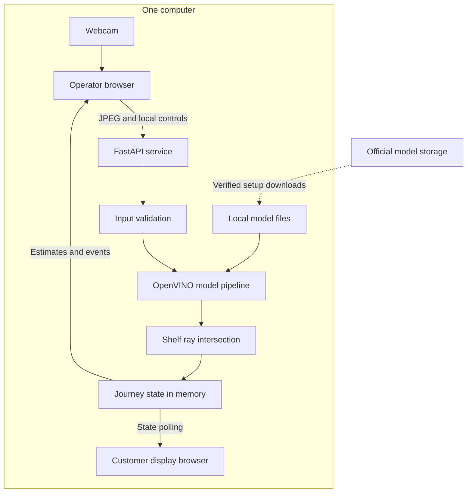
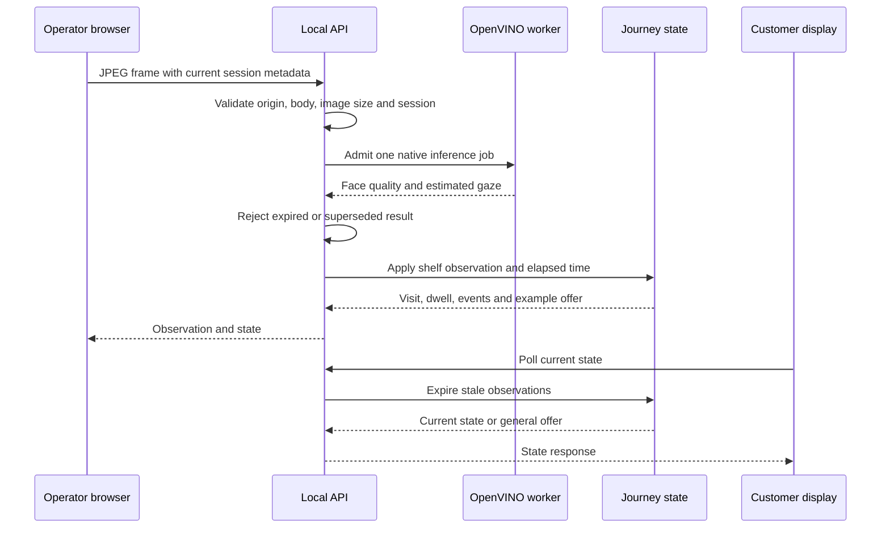

# System architecture: Trace

## Overview

Trace is a local, single-process webcam application. A browser captures images, a Python service estimates gaze using OpenVINO, and a small state machine measures continuous gaze towards three configured shelf zones. A second browser view displays example offers.

The intended experiment is a single visible visitor at a fixed shelf. The system does not identify returning shoppers, recognise products, confirm purchases or establish a person's intent. It trades physical accuracy and multi-person tracking for a small, inspectable prototype that runs without a paid inference API.

## Key requirements

- Shoppers do not perform a calibration routine; the operator supplies camera and shelf geometry.
- Process camera frames locally and avoid storing images or biometric templates.
- Leave unclear observations unassigned and remove stale offers.
- Prevent stopped, reset or superseded work from reviving an old visit.
- Bound request bodies, image dimensions, event history and concurrent native inference.
- Give the operator useful failure messages and a way to recover.
- Keep setup and evidence limitations visible. No physical shelf accuracy target has been validated.

## High-level architecture

Only setup downloads cross the computer boundary. The running service uses loopback HTTP and memory rather than a database, queue, cloud service or public endpoint.

## Component details

| Component | Responsibilities | Owned data and communication |
| --- | --- | --- |
| `static/index.html`, `app.js`, `style.css` | Camera lifecycle, operator controls, visual estimates, configuration feedback | A browser media stream, pending frame and request state; JPEG and JSON requests to the local API |
| `static/client.js` | Shared request deadlines, abort handling and useful error text | Per-request cancellation and response metadata; no persistent storage |
| `static/display.html`, `display.js` | Customer-facing example offer and disconnected fallback | Latest accepted state response; polls the same local service without requesting a camera |
| `server.py` | Routes, lifecycle, same-origin controls, model readiness and request ordering | One configuration, one journey and one model pipeline per process |
| `api_support.py` | Bounded body reads, JPEG header validation, decode checks and structured errors | Short-lived request bytes and safe diagnostic information |
| `vision.py` | Face detection, landmarks, head pose, eye-state and gaze inference | Loaded OpenVINO models and in-memory tensors; returns coordinates and quality checks |
| `geometry.py` | Validate shelf settings and intersect estimated gaze with a shelf plane | Pydantic `ShelfConfig`; pure geometric observations |
| `events.py` | Temporary visit continuity, dwell, offer selection and expiry | One active temporary ID, counters, zone totals and at most 80 recent events |
| `scripts/download_models.py` | Download pinned weights over HTTPS and verify them before use | Atomic temporary downloads, model files and manifest checksums |

The models run on CPU. Model setup uses `curl`; inference does not download code or call an external AI service. Dependency installation is a separate setup operation.

## Data flow

### Camera observation

The server uses a monotonic clock for elapsed time. Native inference is serialised; it cannot be forcibly cancelled once running, so cancelled work remains excluded from the state and retains its execution slot until it finishes.

### Stop, reset and setup changes

A stop ends the logical visit and clears dwell. A reset replaces activity state while retaining the current configuration. A valid setup change ends the visit, replaces geometry settings and preserves the previous aggregate totals until the operator resets them.

Each operation invalidates older inference work. The browser also invalidates pending UI responses so a late status or save response cannot restore old state or overwrite newer form edits. [ERROR_HANDLING.md](docs/ERROR_HANDLING.md) specifies the request ordering contract and legacy-client limits.

### Model setup and failure

The downloader reads `model-provenance.json`, checks existing files, downloads missing or invalid files to a temporary path, verifies size and SHA-384, then replaces the destination atomically. XML model files must also parse with the expected root element.

At startup, the service attempts to construct the pipeline. If that fails, the interface remains available, status reports that the models are unavailable and inference is rejected. There is no fabricated fallback gaze result. The operator repairs the model installation and restarts the service.

## Data model

| Entity | Main values | Lifetime |
| --- | --- | --- |
| Shelf configuration | Dimensions, camera position, eye distance, field of view, dwell threshold and offer hold | Process memory; replaced by a valid setup request |
| Frame result | Image dimensions, face boxes, eye positions, quality reasons, gaze vector and inference duration | One request; no image recording |
| Observation | Status, optional shelf point, optional zone and explanation | One accepted frame |
| Temporary visit | Visit number, last face box, last-seen time and current zone | Continuous visible visit, with a short gap allowance |
| Dwell totals | Current continuous dwell and cumulative seconds per zone | Current run; reset clears totals |
| Offer | Kind, title, detail and optional zone | Derived from current state; always an example |
| Event | Type, explanation, optional zone and UTC timestamp | Bounded deque of the latest 80 events |

Visit IDs describe tracks, not identities. A short disappearance and reappearance can merge two people, and abrupt motion can split one person's visit. Multiple detected faces suspend individual attribution.

## Infrastructure and deployment

`run.sh` starts Uvicorn on `127.0.0.1:4321`. The browser and service run on the same computer; the customer view can use another window or monitor attached to it. Changing to another loopback port is supported through the documented Uvicorn command.

Development and demonstration use the same local runtime. There is no separate production environment, staging deployment, container definition, reverse proxy or Kubernetes configuration. The recorded platform is Python 3.12 on macOS with Apple silicon; other platforms need validation.

One process owns all state. Running several workers or replicas would create separate visits, model instances and offer histories. The app must remain a single-worker local service unless the architecture changes deliberately.

## Scalability and reliability

The browser submits one frame at a time and the API admits at most one native inference job. Contending requests receive a busy response instead of forming an unbounded queue. Body limits and JPEG dimension checks bound input work; the event deque bounds history.

A gap beyond 1.5 seconds clears current gaze, dwell and any zone offer. The 2.5-second visit grace period is a separate continuity rule. These are prototype policy thresholds, not measured human-attention boundaries. The browser's display request deadline and local freshness checks provide additional protection when the service stalls.

The app has no durable storage, failover or process supervisor. Restarting loses configuration and activity. A hung native call may require restarting the service; Python cannot safely terminate the running OpenVINO thread. Current measurements and limits are in [PERFORMANCE.md](docs/PERFORMANCE.md).

## Security and compliance

The service binds to loopback and checks permitted hosts and the origin of writes. Browser content uses a restrictive content security policy, no-store responses and a camera-only permissions policy. A same-origin check does not authenticate local software; the service has no accounts or access roles.

The application processes images in memory and does not save raw frames, face embeddings or names. Diagnostic errors omit request bodies and raw exception messages. The model downloader uses verified HTTPS and pinned integrity checks. Dependency versions are recorded in the lock file.

These controls describe the code, not a compliance certification. Any real retail deployment would need its own operational and data-protection assessment. This prototype is documented and tested as a local experiment.

## Observability

The operator view shows service readiness, visible face count, model inference duration, gaze quality, current dwell and recent journey events. Detection confidence is labelled separately from gaze accuracy. The customer display shows an example offer or a general/offline message.

API failures use a stable code and request identifier for correlation with local diagnostics. Durations use a monotonic clock. Stored event timestamps use UTC; the interface formats them in the browser's local time zone. There is no external telemetry dashboard, distributed tracing or persistent application event store configured by Trace. Third-party dependencies retain their own behaviour and licences.

## Trade-offs and decisions

| Decision | Reason and cost |
| --- | --- |
| Local inference | Keeps camera processing on the computer and avoids an API account; setup needs model downloads and a compatible runtime. |
| Three broad zones | Gives the prototype a testable initial scope; adjacent-product precision is unsupported. |
| Operator-supplied distance | Avoids shopper calibration; movement in depth introduces mapping error. |
| Conservative abstention | Prevents unclear estimates from driving offers; more visits may remain unassigned. |
| Temporary tracks | Avoids identity enrolment; cannot measure returning customers or unique people reliably. |
| In-memory state | Small and easy to inspect; restarts lose evidence. |
| Serial native inference | Avoids sharing mutable inference requests concurrently; throughput is limited to one camera stream. |
| Plain browser code | Few runtime dependencies; client request ordering must be tested explicitly. |

## Future improvements

The next physical experiment should compare known target locations with estimated zones across distances and lighting conditions. Record failures and abstention as well as successful estimates. No algorithm benchmark in this repository substitutes for that experiment.

[RESEARCH.md](docs/RESEARCH.md) separates justified quick fixes from possible depth-aware mapping, calibrated uncertainty and longer research work. Pickup/return detection, checkout integration and repeat-visitor recognition remain separate product decisions, not hidden parts of this implementation.
