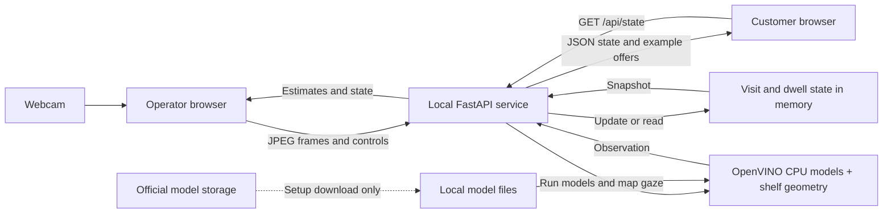

# Trace

A local webcam experiment to study how people browse a shop shelf.

## Description

Sales records show what shoppers bought, but leave much of their browsing unrecorded. Trace is an EAT_HACK Retail Futures prototype for retailers and brands exploring what happens before checkout. It uses local webcam gaze estimates to study which parts of a shelf people look towards and how that changes over time, without asking survey questions.

The app estimates gaze towards three broad shelf zones, groups observations into temporary visits and shows an example offer after sustained gaze towards a zone. The operator enters the camera and shelf measurements; shoppers do not complete a calibration routine.

Estimated gaze does not establish preference or intent to buy. Trace does not detect product pickups, returning customers or purchases. Physical gaze accuracy remains unverified, and trend forecasting is not implemented. The [forecasting plan](#path-to-trend-forecasting) explains the data and validation needed to take this measurement prototype further.

The interface calls the app Shelf Trace. Start with [installation](#installation), watch the [quick tour](#quick-tour), browse the [screenshots](#screenshots-and-demo), or explore the [Trace system map](#interactive-trace-system). The [architecture guide](ARCHITECTURE.md) covers the technical details.

## Quick tour

The 20-second loop below follows the operator dashboard, an invalid camera height, the corrected setup being saved and the idle customer display. It uses real browser captures, with each state held briefly for readability. The camera stays off throughout.


[Watch or download the MP4](docs/videos/trace-ui-walkthrough.mp4) for playback controls. The [screenshots and explanations](#screenshots-and-demo) describe each screen in more detail.

## Contents

| What you want to do | Where to go |
| --- | --- |
| See what Trace does | [Description](#description), [quick tour](#quick-tour), [current functions](#features), [limits](#current-limits), [screenshots](#screenshots-and-demo) |
| Run it locally | [Installation](#installation), [usage](#usage), [configuration](#configuration), [troubleshooting](#troubleshooting) |
| Understand the system | [Tech stack](#tech-stack), [architecture overview](#architecture-overview), [interactive map](#interactive-trace-system), [API and CLI reference](#api-and-cli-reference) |
| Review evidence and plans | [Tests](#tests), [roadmap](#roadmap), [path to trend forecasting](#path-to-trend-forecasting) |
| Contribute or get help | [Contributing](#contributing), [licence](#licence), [contact and support](#contact-and-support) |

## Features

These functions are implemented in the current local build. The operator uses the main page; the customer screen is at `/display`.

| Function | What it does now |
| --- | --- |
| Start and stop the camera | **Start camera** requests browser permission and begins local processing. **Stop** releases the webcam, ends the current visit and clears its estimate and offer while keeping run totals and activity. |
| Show the camera estimates | Displays an unmirrored preview with face boxes and gaze arrows where available, plus detected face count, face detection confidence and inference time. Face confidence is not a gaze-accuracy score. |
| Estimate a shelf zone | Uses the camera and shelf measurements to assign a usable gaze estimate to the left, centre or right zone. Unclear views, multiple faces and estimates outside the shelf or near zone boundaries remain unassigned. |
| Measure estimated gaze time | Shows continuous dwell for the current zone and accumulated seconds per zone during the run. Unclear observations break continuous dwell. A gap of more than 1.5 seconds clears continuous dwell and is not added to the totals. |
| Group observations into visits | Creates temporary labels such as `Visit 001` and shows a visit count. Continuity uses face position and short gaps in visibility. It does not recognise a person's identity. |
| Trigger an example offer | Sustained estimated gaze can show a protein bar, drink or snack offer after the dwell threshold, which defaults to 1.5 seconds. The offer hold setting defaults to 8 seconds and limits switching between valid zone offers. Unclear or stale observations clear the zone offer. |
| Run a separate customer display | Shows the current example offer or a general discovery message in another window or on a monitor attached to the same computer. It reads local state without opening a second camera. If the connection fails, it clears the offer and retries automatically. |
| Configure and validate the shelf | Saves shelf size, camera position, approximate eye distance, field of view, dwell threshold and offer hold time. Invalid values produce a specific error and leave the saved setup unchanged. A successful save ends the current visit while retaining run totals. |
| Review recent activity | Lists visit starts and ends, qualifying zone dwell, displayed offers and setup changes, with timestamps. The dashboard shows the latest 12 events; the local API exposes up to 80 retained events. |
| Reset a run | **Reset run** clears visits, accumulated zone totals, activity and the current offer while retaining shelf settings. Camera capture continues if it was running; use **Stop** to release it. |
| Recover from interruptions | Shows model, camera, validation and connection errors. After detecting a service restart, it stops capture and requires a successful setup save before restarting. Returning to the page after navigation leaves the camera off. |
| Read and control the local service | The [JSON API](#api-and-cli-reference) exposes model readiness, settings, current visit, dwell totals, offers and recent events. It also accepts setup changes, JPEG frames, stop and reset requests. |

Processing uses five OpenVINO models on CPU for faces, landmarks, head pose, eye state and gaze direction. After installation and model download, it runs without an external inference service or API key. Same-origin write controls, bounded inputs and cancellation checks protect the local request flow.

### Current limits

Trace currently supports one active operator and one camera, with one clear face needed for zone attribution. The three protein categories and their offers are fixed demonstration examples. It does not recognise individual products, detect pickups or purchases, identify returning customers, infer demographics or provide redeemable discounts. A temporary visit can split or merge observations, so the total is not a count of unique shoppers.

Settings, totals and recent events live in memory. A server restart discards them. There is no database, saved browsing history or CSV export button. The app does not save camera images, recordings or face embeddings.

Search trends, social media and retailer sales are not connected, and future-trend prediction is not implemented. The [forecasting plan](#path-to-trend-forecasting) describes that proposed work.

The [software audit](docs/AUDIT.md) records automated checks and browser checks with the camera off. Physical shelf gaze accuracy remains unverified. The [animated walkthrough](#quick-tour) demonstrates controls and setup feedback; it does not demonstrate live gaze tracking.

## Tech stack

| Area | Technology |
| --- | --- |
| Interface | HTML, CSS, plain JavaScript, browser camera and Canvas APIs |
| Local service | Python 3.12, FastAPI, Uvicorn, Pydantic |
| Vision | OpenVINO on CPU, OpenCV, NumPy |
| Models | Open Model Zoo face, landmark, head pose, eye-state and gaze models |
| Tests | pytest for Python, Node's built-in test runner for JavaScript |
| State | Python objects and a bounded event deque; no database |

## Architecture overview



Both browser views communicate with the API on the same computer. The API runs the models, maps gaze onto the shelf and updates visit state. The customer view polls the API for a JSON snapshot; it does not receive camera frames or read Python state directly. Models are downloaded during setup. The app has no external inference service or database.

See [ARCHITECTURE.md](ARCHITECTURE.md) for request flows, data ownership and reliability limits.

### Interactive Trace system

Explore how a camera frame becomes a shelf-zone estimate, how the customer display receives updates and how model files are installed.

[](https://masterasnackin.github.io/trace-eat-hack/#focus=state-api&reach=downstream)

This 23-second loop follows model setup, camera processing and customer display polling, then shows how the State API reads temporary visit state. It uses real browser captures, held briefly for readability. The arrows describe the code structure; they do not show live camera activity or measured traffic.

[Open the interactive map at State API](https://masterasnackin.github.io/trace-eat-hack/#focus=state-api&reach=downstream) · [Pause or scrub the MP4](docs/videos/trace-system-walkthrough.mp4) · [Open the GIF](docs/diagrams/trace-system-walkthrough.gif)

The public viewer needs no sign-in or running webcam app. Select a component to read its explanation and source links, or choose a guided view:

| View | What it explains |
| --- | --- |
| [Frame to offer](https://masterasnackin.github.io/trace-eat-hack/#view=frame-path) | Follows camera data through the frame API, vision pipeline, shelf geometry and temporary visit state. |
| [Customer display](https://masterasnackin.github.io/trace-eat-hack/#view=display-poll) | Shows how the customer page polls the state API and receives the current message or example offer. |
| [Model setup](https://masterasnackin.github.io/trace-eat-hack/#view=model-setup) | Follows the download, size and checksum checks, local model files and model loading for inference. |
| [State API downstream](https://masterasnackin.github.io/trace-eat-hack/#focus=state-api&reach=downstream) | Highlights the API's `snapshot()` call to Journey, which holds temporary visit state. The customer display's `GET` poll is an incoming connection. |

Select **Show all** to return to the complete map. The viewer also has search, zoom, pan and light/dark themes. Source links open the code at revision `cacc96fc7d41` and require internet access. This map describes the implementation; it does not validate gaze accuracy.

To use the viewer offline, [get the interactive HTML](docs/diagrams/trace-system.html), choose **Download raw file** on GitHub and open the saved file in your browser. If you have cloned the repository, open `docs/diagrams/trace-system.html` directly. Still previews are available in [light](docs/diagrams/trace-system-light.jpg) and [dark](docs/diagrams/trace-system-dark.jpg) themes.

GitHub supports the Mermaid overview above but removes custom scripts from rendered Markdown, so the README links to the interactive viewer on GitHub Pages. See [GitHub's rendering rules](https://github.com/github/markup#github-markup). Pages serves only the system map; the webcam app and API still run locally. The [editable diagram data](docs/diagrams/trace-system.architecture.json) is included for future updates. Changes to the viewer HTML on `main` publish through the [map deployment workflow](.github/workflows/deploy-map.yml).

## Installation

You need Git, Python 3.12, `curl` and a webcam. The commands below use a macOS or Linux shell. Runtime checks used an Apple M4 Max running macOS; Linux and Windows have not been validated. You only need Node.js 22 or later to run the JavaScript tests.

```sh
git clone https://github.com/MasteraSnackin/trace-eat-hack.git
cd trace-eat-hack
python3.12 -m venv .venv
.venv/bin/python -m pip install -r requirements-lock.txt
.venv/bin/python scripts/download_models.py
./run.sh
```

The downloader retrieves about 18.7 MB of model data from Intel's storage over verified HTTPS, then checks file sizes and SHA-384 hashes against pinned manifests. You need internet access to install dependencies and download models. After setup, the app runs locally without an API key.

Model weights, virtual environments and caches are excluded from Git. Do not copy them into a commit.

Leave the terminal running. Open the [operator view](http://127.0.0.1:4321) and look for "Gaze service ready". The camera stays off until you start it. If the service cannot load its models, follow [model recovery](#troubleshooting).

## Usage

Open the [operator view](http://127.0.0.1:4321), set up the shelf as described below and choose **Save shelf setup**. Then choose **Start camera** and grant the browser's camera permission. Open the [customer display](http://127.0.0.1:4321/display) in a separate window or on another monitor.

Use one active operator window and keep it visible for reliable frame timing. Browsers can throttle background tabs. Navigating away from or closing the page stops capture, and returning to it does not restart the camera.

For a physical check:

1. Mount a level webcam in the shelf plane, facing the shopper.
2. Arrange three large, equal-width zones: bars, drinks and snacks, as seen by the shopper.
3. Enter measured shelf dimensions and camera position, along with the approximate eye distance and camera field of view. Choose **Save shelf setup** to apply them; typing into the form alone does not save changes.
4. Have one person with clearly visible eyes look towards known locations, then compare those locations with the estimated zones. This checks the installation. Shoppers do not need to repeat it.

A laptop webcam can show gaze estimates, but shelf mapping requires the configured shelf to be in the camera's plane. The app does not measure depth or compensate for camera tilt or lens distortion. Glasses, lighting, occlusion, head movement and changes in distance can affect the result.

**Stop** releases the browser camera. **Reset run** clears activity while retaining the current settings. Restarting the server clears both settings and activity. Stop the server with Ctrl+C.

When an open operator page detects a server restart, it stops capture and asks you to review and save the setup before starting again. If the form has no unsaved edits, it loads the restarted service's settings. Unsaved edits stay in the form. Returning to a page after navigation does not restart capture automatically.

If port 4321 is occupied, use a different loopback port:

```sh
.venv/bin/python -m uvicorn server:app --host 127.0.0.1 --port 4322 --no-access-log
```

Open both views on the same chosen port. Do not bind the service to a public network interface; it has no user authentication.

### Troubleshooting

| What you see | What to do |
| --- | --- |
| The service cannot load the gaze models | Stop the server, run `.venv/bin/python scripts/download_models.py`, then start it again. The downloader reuses valid files and replaces missing or invalid ones. Models load at server startup. |
| Camera permission denied, no camera found or camera unavailable | Allow camera access for the local page, connect a webcam, or close another app using it, according to the displayed error. Use a browser that supports camera access on localhost. |
| Start is disabled after a restart | Review the shelf settings and choose **Save shelf setup**. Start becomes available once the service is ready and the save succeeds. |
| The customer display says "Local connection paused" | Check that the local service is running and both views use the same port. The display retries automatically. |
| Gaze remains unassigned | Check the physical setup and that one face has clearly visible, open eyes. Unclear views, multiple faces, estimates outside the shelf and estimates near boundaries remain unassigned. Physical accuracy still needs testing. |

For API status codes and recovery details, see [error handling](docs/ERROR_HANDLING.md).

## Configuration

You do not need environment variables or API keys. Enter settings in the operator form or send them to `POST /api/config`. The service keeps them in memory.

| Setting | Default | Accepted range |
| --- | --- | --- |
| Shelf width | 1.2 m | 0.3 to 5 m |
| Shelf height | 0.6 m | 0.2 to 3 m |
| Camera height from shelf bottom | 0.3 m | 0 to 3 m, within the shelf height |
| Camera offset from centre | 0 m | -2.5 to 2.5 m, within half the shelf width |
| Approximate eye distance | 1 m | 0.35 to 4 m |
| Horizontal field of view | 65 degrees | 25 to 120 degrees |
| Continuous gaze threshold | 1.5 s | 0.5 to 15 s |
| Offer hold time | 8 s | 3 to 60 s |

Left and right follow the shopper's view of the shelf. A positive camera offset is towards the shopper's right. The preview is unmirrored, so camera-image right corresponds to the shopper's left.

Changing the setup ends the current visit and clears its dwell time. The accumulated totals remain until you reset the run. Reset them before comparing results from a new setup.

## Screenshots and demo

This walkthrough shows the operator controls, shelf estimates, setup feedback and separate customer screen. The captures were taken on 3 October 2026. The detailed views use a separate local session with the camera off; the only recorded activity is a saved setup. They explain the interface and do not demonstrate physical gaze accuracy or a forecast.

The [quick tour](#quick-tour) shows the sequence as an animation. The still images below explain each part of the interface.

Jump to [camera controls](#camera-controls), [shelf figures](#reading-the-shelf-figures), [setup and activity](#shelf-setup-and-activity), [validation](#when-measurements-do-not-fit) or the [customer display](#customer-display).

<details>
<summary>Full desktop operator view</summary>

The full view is 1,440 pixels wide. The gaze service is ready, with the camera off and no observations recorded in this overview capture.


</details>

### Camera controls

**Start camera** requests browser permission and begins local frame processing. During a run, this panel shows an unmirrored preview, estimated gaze direction, visible face count and inference time. **Stop** releases the camera and ends the current visit while retaining the run totals and activity log.

This capture shows the ready state, so the preview and measurements are empty. Face detection confidence describes the face detector; it is not a gaze-accuracy score. Unclear observations remain unassigned.


### Reading the shelf figures

The three cards represent fixed left, centre and right zones. The protein labels are demonstration categories, not products recognised by the camera.

| Figure | What it means |
| --- | --- |
| Seconds beneath each category | Accumulated estimated gaze time towards that zone during this run |
| Continuous gaze estimate | The current uninterrupted period of estimated gaze towards one zone |
| Current visit | A temporary visual track; it does not identify a person |
| Visits this run | The number of temporary visits, not a count of unique or returning customers |
| Customer display preview | The current general message or example offer supplied by the service |

During capture, sustained estimated gaze can trigger a zone-specific example offer after the configured dwell threshold. The zero values below are the idle state; no offer was triggered for this screenshot.


### Shelf setup and activity

The operator enters the shelf dimensions, camera position, approximate eye distance and field of view, then chooses **Save shelf setup**. These values describe the equipment. Saving them does not validate gaze accuracy, and shoppers do not complete a calibration routine.

The activity panel lists recent events, newest first. This capture shows the real **Setup changed** event created by saving the form. It contains no shopper observation. During a run, the log can also show visit starts, qualifying zone dwell and displayed offers.

**Reset run** clears activity, visits and accumulated totals while keeping the shelf settings. If capture is running, it continues after the reset; use **Stop** to release the camera.


### When measurements do not fit

Here the shelf is 0.6 m high, but the camera height was entered as 2 m from its bottom edge. Saving produces **Could not save: Camera height must be within the shelf height.** The previous saved configuration remains in use. Correct the value and save again; the valid setup above uses a camera height of 0.3 m.


### Customer display

Open `/display` in another window or on a monitor attached to the same computer. It receives state from the local service without requesting its own camera access.

This screenshot shows the idle message, **Find your next favourite.**, with **Ready for the next visit** in the footer. During capture, a qualifying gaze estimate can change the message to a zone-specific example offer. Unclear or stale observations return it to a general message. If a state request fails, it shows **Local connection paused** and clears the previous offer. Every offer is a demonstration and cannot be redeemed.


[The audit report](docs/AUDIT.md) contains additional screenshots of tested flows and recovery states.

The audit's short [before](docs/videos/before-setup-validation.mp4) and [after](docs/videos/after-setup-validation.mp4) browser recordings show setup validation without using the camera. These debugging clips are separate from the EAT_HACK working-product submission video, which has not been added. A hosted live demo has not been added; the app runs on your computer.

## API and CLI reference

The loopback server provides all the routes below and rejects cross-origin writes. Use one operator and one server process.

| Method and route | Purpose |
| --- | --- |
| `GET /` | Operator interface |
| `GET /display` | Customer display |
| `GET /api/status` | Model readiness, settings and current state |
| `GET /api/config` | Current shelf settings |
| `POST /api/config` | Validate and apply shelf settings |
| `GET /api/state` | Current visit, dwell, offers and recent events |
| `POST /api/infer` | Process one JPEG camera frame |
| `POST /api/stop` | Stop the logical visit and invalidate pending results |
| `POST /api/reset` | Clear activity and invalidate pending results |

```sh
curl --fail http://127.0.0.1:4321/api/status
curl --fail -X POST http://127.0.0.1:4321/api/reset
```

Inference expects `Content-Type: image/jpeg`. Each input must be no larger than 2,000,000 bytes, with decoded dimensions between 120 and 1920 pixels per side. Concurrent inference receives HTTP 429; an obsolete session result receives 409. [Error handling](docs/ERROR_HANDLING.md) explains the error responses and how to recover.

The model downloader accepts an alternate destination and a verification-only mode:

```sh
.venv/bin/python scripts/download_models.py --verify-only
.venv/bin/python scripts/download_models.py --model-dir /tmp/trace-models
```

The service loads models from this repository's `models/` directory. An alternate download destination does not change the service configuration.

## Tests

The locked installation above includes the Python test dependencies. Run the software tests without a webcam or downloaded model weights:

```sh
.venv/bin/python -m pytest -q
node --test tests/*.mjs
```

Check downloaded model files separately. This command reports an error if a file is missing or fails verification:

```sh
.venv/bin/python scripts/download_models.py --verify-only
```

Python tests cover geometry, dwell, offer expiry, validation and concurrent request handling. The JavaScript tests cover how the client handles errors and state. Tests use synthetic fixtures, and API tests inject vision pipelines. Passing them does not establish physical webcam performance or gaze accuracy.

[Model provenance](model-provenance.json) records separate checks using publisher samples. [PERFORMANCE.md](docs/PERFORMANCE.md) contains the current profiling results and commands to reproduce the benchmarks. The [audit](docs/AUDIT.md) separates automated and browser checks from physical checks that remain unverified.

The [review plan](PLAN.md) maps the nine task briefs to their reports. For implementation changes, start with the [architecture guide](ARCHITECTURE.md); for a reproduced failure, use the [debugging report](docs/DEBUG.md).

## Roadmap

- Validate the camera and shelf mapping against known target positions, with separate results for distance, lighting and occlusion.
- Evaluate depth-aware mapping and uncertainty estimates before narrowing the zones to individual products.
- Investigate pickup and return detection as a separate observation signal.

These are future work. Product recognition, returning-customer identification, demographic inference, purchases and redeemable promotions are not implemented.

### Path to trend forecasting

The proposed first forecast is next week's share of estimated gaze time towards each shelf zone. Forecasting sales would require retailer purchase data as well. Neither forecast is part of the current build.

1. Validate the physical measurements, then save timestamped daily aggregates across comparable periods. The app currently loses its activity history on restart. Track valid and unassigned observations so changing camera visibility is not mistaken for changing interest.
2. Record which products or categories occupy each zone, with dated changes to layout, prices, stock availability and promotions. This would begin with an operator-maintained shelf map; the current camera pipeline does not recognise products. Log the display's own offers because they could affect the behaviour being measured.
3. Compare shelf measurements with relevant UK search-interest data and, when available, retailer sales. [Google Trends](https://support.google.com/trends/answer/4365533?hl=en) reports relative search interest, not purchase volumes. No search or sales integration is currently connected.
4. Train on earlier periods and test predictions against later periods that the model has not seen. Compare with a simple forecast such as last week's value, report errors and uncertainty, and retain additional signals only if they improve those results. [Time-series cross-validation](https://otexts.com/fpp3/tscv.html) explains this evaluation approach.

For example, a rising share of estimated gaze time towards a zone containing protein snacks, alongside rising search interest, could prompt a retailer to investigate that category. This is a hypothetical use case, not a finding from Trace. Longer dwell could also reflect confusion, a promotion or a changed shelf position. A useful sales forecast would need evidence that earlier gaze measurements improve predictions of later purchases.

UK-wide trend claims would require evidence from a wider, representative set of shops. The immediate aim is to test whether reliable local shelf measurements add useful information to a forecast.

## Contributing

Open an [issue](https://github.com/MasteraSnackin/trace-eat-hack/issues) with a reproducible problem or a proposed change before adding a dependency or changing the architecture. Keep contributions small and include regression tests for changed behaviour. Do not submit images of shoppers, biometric templates, credentials or generated model files.

This project has not assigned a licence to its original code. Agree contribution and reuse terms with the maintainer before contributing.

The local Python gaze service, shelf geometry, temporary visit logic and interfaces were developed for EAT_HACK. The pretrained models and upstream [Open Model Zoo gaze demo](https://github.com/openvinotoolkit/open_model_zoo/tree/a6946b6d6ce42cbf4278df20275fab199655fc7d/demos/gaze_estimation_demo/cpp) existed beforehand. The earlier Shelf photo-to-advert application is a separate project and is not included here. The submission must disclose these pre-existing components.

## Licence

The original application code has no assigned licence, and there is no root `LICENSE` file. Making the repository public does not grant a general reuse licence.

The selected model manifests specify Apache 2.0. The upstream text is in [THIRD_PARTY_LICENSES](THIRD_PARTY_LICENSES/); Python dependencies retain their own licences. [model-provenance.json](model-provenance.json) records pinned model sources and hashes.

## Contact and support

Use [GitHub issues](https://github.com/MasteraSnackin/trace-eat-hack/issues) for support and the [repository](https://github.com/MasteraSnackin/trace-eat-hack) for code and updates. No separate support email or website is published for this project.
