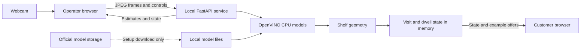

# Trace

A local webcam experiment for understanding browsing at a shop shelf.

## Description

Trace estimates gaze towards three broad shelf zones, records continuous visits and shows an example offer after sustained gaze towards a zone. It is an EAT_HACK Retail Futures prototype for retailers and brands exploring what happens before checkout.

Shoppers do not complete a calibration routine. The operator supplies the camera and shelf measurements. Gaze direction is an estimate: it does not establish preference or intent to buy. Product pickups, returning customers and purchases are not detected.

The interface uses the name **Shelf Trace**. See [the review plan](PLAN.md) for the work completed against the nine supplied task briefs.

## Contents

- [Features](#features)
- [Tech stack](#tech-stack)
- [Architecture overview](#architecture-overview)
- [Installation](#installation)
- [Usage](#usage)
- [Configuration](#configuration)
- [Screenshots and demo](#screenshots-and-demo)
- [API and CLI reference](#api-and-cli-reference)
- [Tests](#tests)
- [Roadmap](#roadmap)
- [Contributing](#contributing)
- [Licence](#licence)
- [Contact and support](#contact-and-support)

## Features

- Local CPU inference with five OpenVINO models for faces, landmarks, head pose, eye state and gaze direction.
- Approximate left, centre and right shelf zones, with uncertain observations left unassigned.
- Temporary visit IDs, continuous gaze duration and a bounded event history held in memory.
- Example offers after a configurable dwell threshold, with a general message when the signal becomes unclear or stale.
- Separate operator and customer views. Offers are demonstrations and cannot be redeemed.
- Same-origin write controls, bounded input sizes and cancellation checks for stopped or reset sessions.

The application does not save camera images, recordings or face embeddings. Visit IDs can split or merge observations; they are not counts of unique or recognised people.

## Tech stack

| Area | Technology |
| --- | --- |
| Interface | HTML, CSS, plain JavaScript, browser camera and Canvas APIs |
| Local service | Python 3.12, FastAPI, Uvicorn, Pydantic |
| Vision | OpenVINO on CPU, OpenCV, NumPy |
| Models | Open Model Zoo face, landmark, head pose, eye-state and gaze models |
| Tests | pytest for Python, Node's built-in test runner for JavaScript |
| State | Python objects and a bounded event deque; no database |

## Architecture overview



The browser sends frames to a service on the same computer. The service estimates gaze, maps it onto the configured shelf and updates temporary state; the customer view polls that state. Model downloads happen during setup, and there is no external inference service or database.

See [ARCHITECTURE.md](ARCHITECTURE.md) for request flows, data ownership and reliability limits.

## Installation

Use Python 3.12, `curl` and a webcam. The commands below use a macOS or Linux shell; runtime checks were performed on an Apple M4 Max running macOS. Linux and Windows have not been validated. Node.js 22 or later is needed only for the JavaScript tests.

```sh
git clone https://github.com/MasteraSnackin/trace-eat-hack.git
cd trace-eat-hack
python3.12 -m venv .venv
.venv/bin/python -m pip install -r requirements-lock.txt
.venv/bin/python scripts/download_models.py
./run.sh
```

The downloader retrieves about 18.7 MB of model data from Intel's storage over verified HTTPS. It checks file sizes and SHA-384 hashes against pinned manifests. Internet access is needed to install dependencies and download models; the prepared app then runs locally without an API key.

Model weights, virtual environments and caches are excluded from Git. Do not copy them into a commit.

## Usage

Open the [operator view](http://127.0.0.1:4321), check the shelf settings, then choose **Start camera** and grant the browser's camera permission. Open the [customer display](http://127.0.0.1:4321/display) in a separate window or on another monitor. Keep the operator view visible for reliable frame timing, since browsers can throttle background tabs. Leaving or closing the page stops its capture session; returning does not restart the camera. Use one active operator window.

For a physical check:

1. Mount a level webcam in the shelf plane, facing the shopper.
2. Arrange three large, equal-width zones: bars, drinks and snacks, as seen by the shopper.
3. Enter measured shelf dimensions and camera position, along with the approximate eye distance and camera field of view.
4. With one person and clearly visible eyes, look towards known locations and compare them with the estimated zones. This tests the installation; it is not a calibration routine required of every shopper.

A laptop webcam can show gaze estimates, but shelf mapping requires the configured shelf to be in the camera's plane. The app does not measure depth or compensate for camera tilt or lens distortion. Glasses, lighting, occlusion, head movement and changes in distance can affect the result.

**Stop** releases the browser camera. **Reset run** clears activity while retaining the current settings. Restarting the server clears both settings and activity. Stop the server with Ctrl+C.

If port 4321 is occupied, use a different loopback port:

```sh
.venv/bin/python -m uvicorn server:app --host 127.0.0.1 --port 4322 --no-access-log
```

Open both views on the same chosen port. Do not bind the service to a public network interface; it has no user authentication.

## Configuration

There are no required environment variables or API keys. Settings are entered in the operator form or sent to `POST /api/config`; they are held in memory.

| Setting | Default | Accepted range |
| --- | --- | --- |
| Shelf width | 1.2 m | 0.3 to 5 m |
| Shelf height | 0.6 m | 0.2 to 3 m |
| Camera height from shelf bottom | 0.3 m | 0 to 3 m, within the shelf height |
| Camera offset from centre | 0 m | -2.5 to 2.5 m, within half the shelf width |
| Approximate eye distance | 1 m | 0.35 to 4 m |
| Horizontal field of view | 65 degrees | 25 to 120 degrees |
| Continuous gaze threshold | 1.5 s | 0.5 to 15 s |
| Offer hold time | 8 s | 3 to 60 s |

Left and right follow the shopper's view of the shelf. A positive camera offset is towards the shopper's right. The preview is unmirrored, so camera-image right corresponds to the shopper's left.

Changing setup ends the current visit and clears its dwell. Aggregate totals remain until reset, so reset the run before comparing results from a new setup.

## Screenshots and demo

[The audit report](docs/AUDIT.md) contains captured screens and the tested flows. These show the interface and its recovery states, not a validated shopping experiment.


The audit includes short [before](docs/videos/before-setup-validation.mp4) and [after](docs/videos/after-setup-validation.mp4) browser recordings of setup validation. These camera-free debugging clips are separate from the EAT_HACK working-product submission video, which has not been added. A hosted live demo has not been added; the app runs on your computer.

## API and CLI reference

All routes below are on the loopback server. Cross-origin writes are rejected. Use only one operator and one server process.

| Method and route | Purpose |
| --- | --- |
| `GET /` | Operator interface |
| `GET /display` | Customer display |
| `GET /api/status` | Model readiness, settings and current state |
| `GET /api/config` | Current shelf settings |
| `POST /api/config` | Validate and apply shelf settings |
| `GET /api/state` | Current visit, dwell, offers and recent events |
| `POST /api/infer` | Process one JPEG camera frame |
| `POST /api/stop` | Stop the logical visit and invalidate pending results |
| `POST /api/reset` | Clear activity and invalidate pending results |

```sh
curl --fail http://127.0.0.1:4321/api/status
curl --fail -X POST http://127.0.0.1:4321/api/reset
```

Inference expects `Content-Type: image/jpeg`. Input is limited to 2,000,000 bytes and decoded dimensions between 120 and 1920 pixels per side. Concurrent inference receives HTTP 429; an obsolete session result receives 409. [Error handling](docs/ERROR_HANDLING.md) documents the error contract and recovery paths.

The model downloader accepts an alternate destination and a verification-only mode:

```sh
.venv/bin/python scripts/download_models.py --verify-only
.venv/bin/python scripts/download_models.py --model-dir /tmp/trace-models
```

The service loads models from this repository's `models/` directory. An alternate download destination does not change the service configuration.

## Tests

```sh
.venv/bin/python -m pytest -q
node --test tests/*.mjs
.venv/bin/python scripts/download_models.py --verify-only
```

Python tests cover geometry, dwell, offer expiry, validation and concurrent request handling. JavaScript tests cover client error and state handling. Fixtures are synthetic, and API tests use injected vision pipelines. Passing tests does not establish physical webcam performance or gaze accuracy.

[Model provenance](model-provenance.json) records separate checks using publisher samples. Current profiling and reproducible benchmark commands are in [PERFORMANCE.md](docs/PERFORMANCE.md). The [audit](docs/AUDIT.md) distinguishes automated, browser and unverified physical checks.

## Roadmap

- Validate the camera and shelf mapping against known target positions, with separate results for distance, lighting and occlusion.
- Evaluate depth-aware mapping and uncertainty estimates before narrowing the zones to individual products.
- Investigate pickup and return detection as a separate observation signal.

These are future work. Product recognition, returning-customer identification, demographic inference, purchases and redeemable promotions are not implemented.

## Contributing

Open an [issue](https://github.com/MasteraSnackin/trace-eat-hack/issues) with a reproducible problem or a proposed change before adding a dependency or changing the architecture. Keep contributions small and include regression tests for changed behaviour. Do not submit images of shoppers, biometric templates, credentials or generated model files.

This project has not assigned a licence to its original code. Agree contribution and reuse terms with the maintainer before contributing.

For EAT_HACK, the local Python gaze service, shelf geometry, temporary visit logic and interfaces were developed for the event. The pretrained models and upstream [Open Model Zoo gaze demo](https://github.com/openvinotoolkit/open_model_zoo/tree/a6946b6d6ce42cbf4278df20275fab199655fc7d/demos/gaze_estimation_demo/cpp) existed beforehand. An earlier Shelf photo-to-advert application is separate and is not included here. These prior components must be disclosed in the submission.

## Licence

No licence has been assigned to the original application code. Public visibility does not grant a general reuse licence, and there is no root `LICENSE` file to claim otherwise.

The selected model manifests specify Apache 2.0. The upstream text is in [THIRD_PARTY_LICENSES](THIRD_PARTY_LICENSES/); Python dependencies retain their own licences. [model-provenance.json](model-provenance.json) records pinned model sources and hashes.

## Contact and support

Use [GitHub issues](https://github.com/MasteraSnackin/trace-eat-hack/issues) for support and the [repository](https://github.com/MasteraSnackin/trace-eat-hack) for code and updates. No separate support email or website is published for this project.
