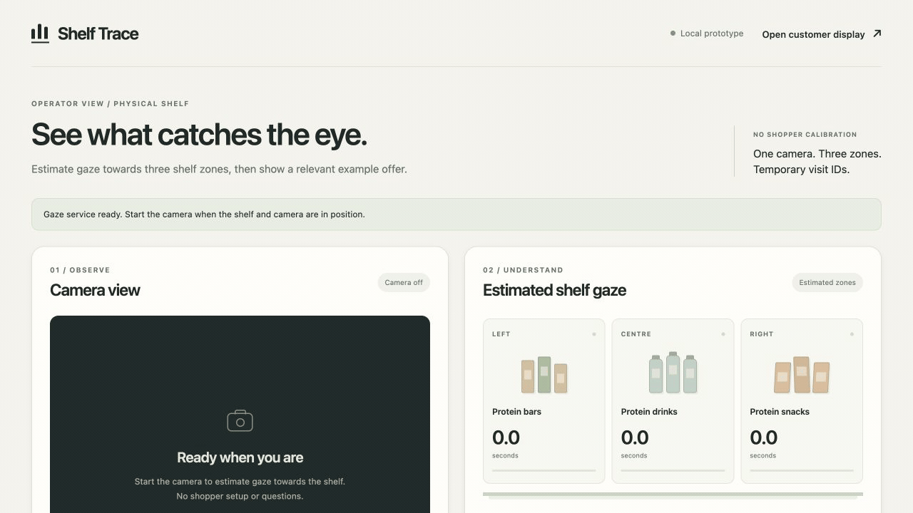
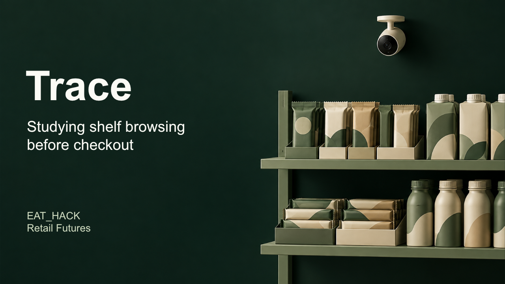
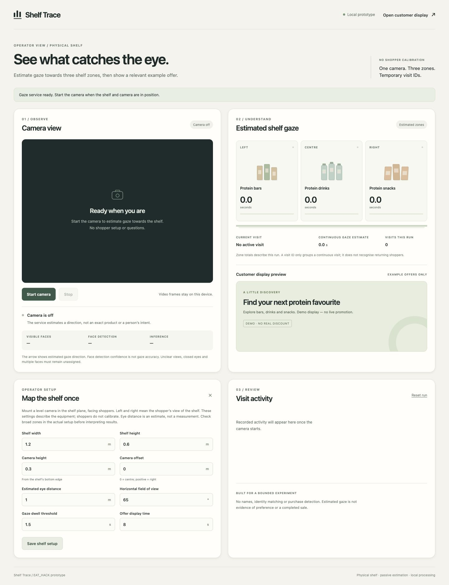
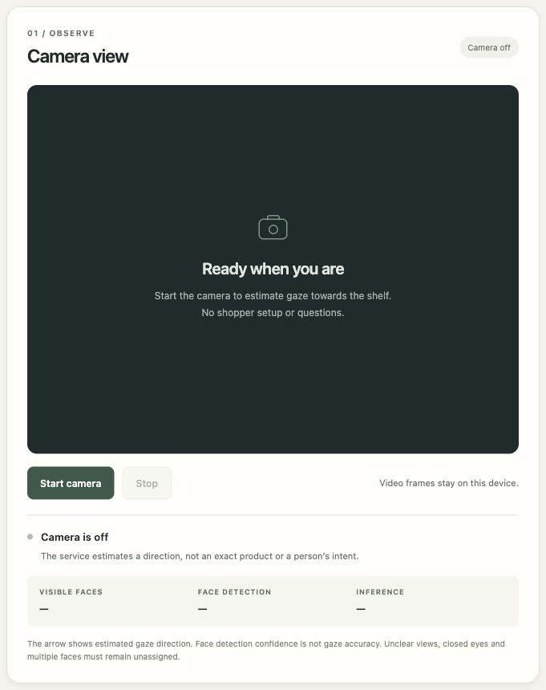
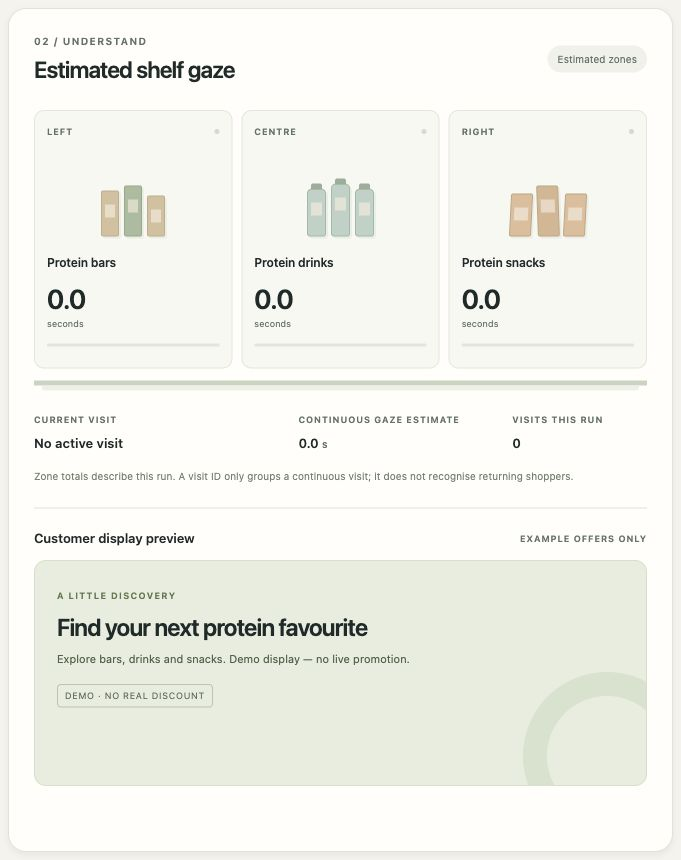
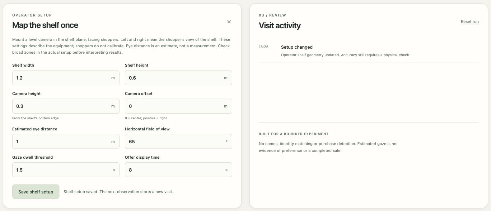
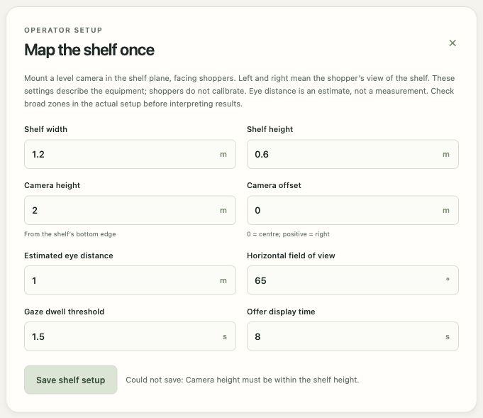
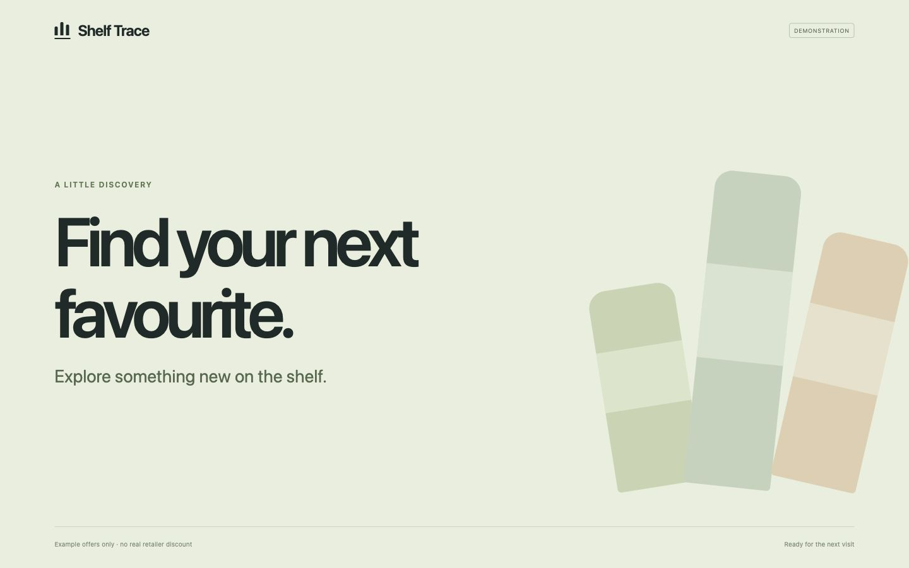
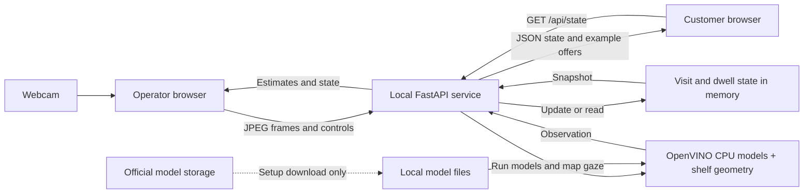
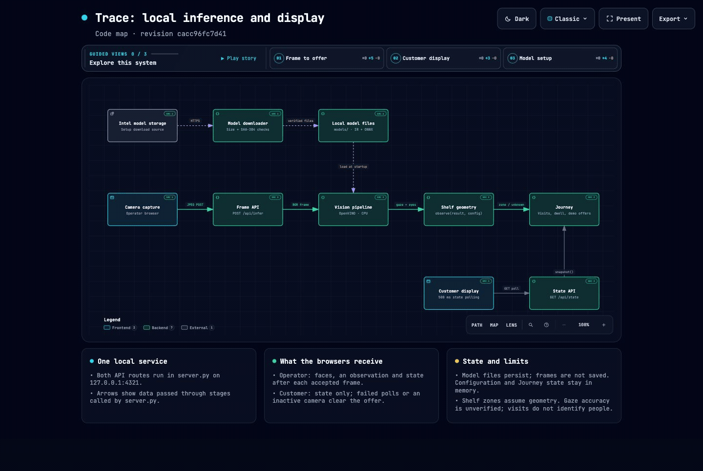

# Shelf Trace

A till tells you what sold. It doesn’t tell you what happened before that decision.

[Demo](#quick-tour) · [Pitch deck](#pitch-deck) · [Run locally](#installation) · [Features](#features) · [System map](#interactive-trace-system) · [Roadmap](#roadmap)

<details>
<summary>Full guide and technical reference</summary>

- Explore: [pitch deck](#pitch-deck), [quick tour](#quick-tour), [features](#features), [screenshots](#screenshots-and-demo).
- Run: [installation](#installation), [usage](#usage), [configuration](#configuration), [troubleshooting](#troubleshooting).
- Understand: [architecture](#architecture-overview), [interactive map](#interactive-trace-system), [API](#api-and-cli-reference).
- Review: [tests](#tests), [roadmap and forecasting](#roadmap).
- Contribute: [guidance](#contributing), [licence](#licence), [support](#contact-and-support).

</details>

## Description

Shelf Trace is an **EAT_HACK Retail Futures prototype** that explores the shopping journey before checkout using one webcam and a nearby customer screen. What caught someone’s attention? What did they pick up, consider, then put back? Could a relevant offer have helped them choose?

Online retailers can study clicks and abandoned baskets. In a physical shop, much of that journey is missing. Asking shoppers questions interrupts the experience and doesn’t always reveal what actually happened.

The newer local prototype brings together three functions:

| Function | What it does |
| --- | --- |
| Estimate shelf gaze | Estimates the broad shelf area someone looks towards and measures how long valid observations continue. |
| Capture shopping signals | Detects visible hands and watches marked product positions to infer pickups and put-backs. |
| Show a relevant offer | Uses observed viewing time, time of day and retailer-entered stock to calculate an example discount. Longer browsing or higher stock can increase it, within a retailer-set limit. Each offer explains its rules. |

Personalisation uses anonymous browsing behaviour, without identifying faces or guessing demographics. The operator can review observations and export a report. The aim is to offer something relevant before the shopper walks away.

These observations are signals of possible interest, not proof of attention, preference, purchase intent or why someone put an item back. Physical shelf accuracy remains unverified. Discounts cannot be redeemed, and the prototype does not record purchases. Real shelf testing comes next, followed by exploring whether reliable pickup and put-back signals could inform offers.

### Project status

| Build | Availability and scope |
| --- | --- |
| Published repository | Gaze estimates across three zones, temporary visits, dwell time and fixed example offers. The instructions, feature reference, screenshots, system map and pitch deck below cover this build. |
| Newer local prototype | Also includes hand detection, inferred pickups and put-backs, configurable discount rules and report export. This implementation has not yet been added to the repository. |

Trend forecasting is [proposed work](#path-to-trend-forecasting).

## Quick tour

This 20-second loop shows the published build's dashboard, a rejected camera height, a corrected setup save and the idle customer display. The real browser captures are held briefly for readability, with the camera off throughout.



[Watch or download the MP4](docs/videos/trace-ui-walkthrough.mp4) for playback controls, or browse the [screenshots and explanations](#screenshots-and-demo).

## Pitch deck

[Open the animated presentation](https://masterasnackin.github.io/trace-eat-hack/pitch/) · [Download the editable PowerPoint](docs/slides/Trace-EAT-HACK-judges-pitch.pptx)

Eight slides for the EAT_HACK judges, with about two minutes of speaker notes. The deck covers the published build, its retail problem, local processing, validation and proposed forecasting, with links to the public demos and repository.

The browser presentation adds animated entrances and staged reveals. Use the arrow keys or Next to advance. Click **Present**, or press **P**, to open an audience tab while keeping notes in the presenter view. [Run or edit the HyperFrames deck locally](docs/pitch/README.md).

<details>
<summary>Preview the title slide</summary>

[](docs/slides/Trace-EAT-HACK-judges-pitch.pptx)

</details>

## Features

The published build estimates gaze towards left, centre and right shelf zones, groups observations into temporary visits and shows an example offer after sustained gaze. The operator uses the main page; the customer screen is at `/display`.

<details>
<summary>Detailed behaviour and controls</summary>

| Function | Current behaviour |
| --- | --- |
| Camera and estimates | Starts local processing after browser permission. Shows an unmirrored preview, face boxes, gaze arrows, face count, detection confidence and inference time. Face confidence is not a gaze-accuracy score. |
| Shelf zones | Assigns usable estimates to left, centre or right. Unclear views, multiple faces and estimates outside the shelf or near boundaries remain unassigned. |
| Gaze time | Shows continuous dwell and accumulated seconds per zone. Unclear observations break dwell. Gaps over 1.5 seconds clear it and do not add to totals. |
| Temporary visits | Groups observations using face position and short visibility gaps, with labels such as `Visit 001`. Visit labels do not identify people. |
| Example offers | Sustained estimated gaze can trigger a protein bar, drink or snack message. The hold setting limits switching between valid offers; unclear or stale observations clear them. |
| Customer display | Reads local state in another window or monitor without opening a second camera. Clears the offer and retries when the connection fails. |
| Shelf setup | Validates equipment measurements and timing settings. Invalid saves leave the previous setup intact; valid saves end the visit while retaining run totals. |
| Activity | Lists visit starts and ends, qualifying dwell, displayed offers and setup changes. The dashboard shows 12 recent events; the API retains up to 80. |
| Controls and recovery | Supports Stop, Reset and recovery from model, camera and connection errors. A service restart requires a successful setup save before capture can restart. |
| Local API | Exposes readiness, settings, visits, dwell, offers and events, and accepts frames and control requests. See the [route reference](#api-and-cli-reference). |

</details>

### Current limits

- One active operator and one camera, with one clear face needed for zone attribution. Temporary visits can split or merge observations, so their total is not a count of unique shoppers.
- Protein categories and offers are fixed examples. There is no product recognition, pickup or purchase detection, returning-customer identification, demographic inference or redeemable discount.
- Settings, totals and recent events live in memory and disappear on server restart. There is no database, saved browsing history or CSV export. The app does not save camera images, recordings or face embeddings.
- Search trends, social media and retailer sales are not connected. Forecasting is [proposed work](#path-to-trend-forecasting).

The [audit](docs/AUDIT.md) records software tests and browser checks with the camera off. These checks and the demo captures do not establish physical shelf gaze accuracy.

## Installation

You need Git, Python 3.12, `curl` and a webcam. The commands below use a macOS or Linux shell. Runtime checks used an Apple M4 Max running macOS; Linux and Windows have not been validated. You only need Node.js 22 or later to run the JavaScript tests.

```sh
git clone https://github.com/MasteraSnackin/trace-eat-hack.git
cd trace-eat-hack
python3.12 -m venv .venv
.venv/bin/python -m pip install -r requirements-lock.txt
.venv/bin/python scripts/download_models.py
./run.sh
```

The downloader retrieves about 18.7 MB of model data from Intel's storage over verified HTTPS, then checks file sizes and SHA-384 hashes against pinned manifests. You need internet access to install dependencies and download models. After setup, the app runs locally without an API key.

Model weights, virtual environments and caches are excluded from Git. Do not copy them into a commit.

Leave the terminal running. Open the [operator view](http://127.0.0.1:4321) and look for "Gaze service ready". The camera stays off until you start it. If the service cannot load its models, follow [model recovery](#troubleshooting).

## Usage

1. Open the [operator view](http://127.0.0.1:4321), enter the shelf measurements and choose **Save shelf setup**.
2. Choose **Start camera** and grant camera permission.
3. Open the [customer display](http://127.0.0.1:4321/display) in another window or on a monitor attached to the same computer.

Keep one operator window active and visible. Background tabs can throttle capture. Leaving the page stops capture; returning does not restart it.

| Control | Effect |
| --- | --- |
| **Stop** | Releases the webcam, ends the visit and clears its estimate and offer. Run totals and activity remain. |
| **Reset run** | Clears visits, totals, activity and the offer while keeping shelf settings. Capture continues if already running. |
| **Save shelf setup** | Applies valid settings and ends the current visit. Reset totals before comparing a new setup. |
| Server restart | Discards settings and activity. Review and save the setup before starting capture again. Unsaved form edits remain; otherwise the form reloads the service defaults. |

For a physical check, mount a level webcam in the shelf plane facing the shopper. Arrange three large, equal-width zones: bars, drinks and snacks, left to right from the shopper's view. Enter measured shelf and camera positions, approximate eye distance and camera field of view. Have one person look towards known targets and compare them with the estimates.

A laptop webcam can show gaze estimates, but shelf mapping needs this geometry. The app does not measure depth or correct camera tilt or lens distortion. Glasses, lighting, occlusion, movement and distance can affect results. This equipment check does not require each shopper to repeat calibration.

Stop the server with Ctrl+C. If port 4321 is occupied, choose another loopback port:

```sh
.venv/bin/python -m uvicorn server:app --host 127.0.0.1 --port 4322 --no-access-log
```

Open both views on the same port. Keep the service on loopback; it has no user authentication.

### Troubleshooting

| Problem | Action |
| --- | --- |
| Gaze models cannot load | Stop the server, run `.venv/bin/python scripts/download_models.py`, then restart. The downloader reuses valid files and replaces missing or invalid ones. |
| Camera unavailable or permission denied | Allow camera access for the local page, connect a webcam or close another app using it, according to the displayed error. |
| Start disabled after restart | Review the settings and choose **Save shelf setup**. The service must also be ready. |
| Customer display says "Local connection paused" | Check that the service is running and both views use the same port. The display retries automatically. |
| Gaze remains unassigned | Check the geometry and that one face has visible, open eyes. Multiple faces, unclear views and estimates near or outside boundaries remain unassigned. |

See [error handling](docs/ERROR_HANDLING.md) for status codes and recovery details.

## Configuration

<details>
<summary>Defaults, accepted ranges and coordinate conventions</summary>

You do not need environment variables or API keys. Enter settings in the operator form or send them to `POST /api/config`. The service keeps them in memory.

| Setting | Default | Accepted range |
| --- | --- | --- |
| Shelf width | 1.2 m | 0.3 to 5 m |
| Shelf height | 0.6 m | 0.2 to 3 m |
| Camera height from shelf bottom | 0.3 m | 0 to 3 m, within the shelf height |
| Camera offset from centre | 0 m | -2.5 to 2.5 m, within half the shelf width |
| Approximate eye distance | 1 m | 0.35 to 4 m |
| Horizontal field of view | 65 degrees | 25 to 120 degrees |
| Continuous gaze threshold | 1.5 s | 0.5 to 15 s |
| Offer hold time | 8 s | 3 to 60 s |

Left and right follow the shopper's view of the shelf. A positive camera offset is towards the shopper's right. The preview is unmirrored, so camera-image right corresponds to the shopper's left.

Changing the setup ends the current visit and clears its dwell time. The accumulated totals remain until you reset the run. Reset them before comparing results from a new setup.

</details>

## Screenshots and demo

These captures show the published build on 3 October 2026, with the camera off and no recorded shopper observations. Expand a view for its screenshot and explanation.

<details>
<summary>Full desktop operator view</summary>

The gaze service is ready, with an empty camera preview and zero totals. The full image is 1,440 pixels wide.



</details>

<details>
<summary>Camera controls</summary>

Start and Stop manage the webcam. During capture, this panel shows face boxes, gaze direction and inference measurements. The ready state below has an empty preview.



</details>

<details>
<summary>Shelf estimates and what the figures mean</summary>

The cards show fixed left, centre and right zones. Protein labels are demonstration categories, not recognised products.

| Figure | Meaning |
| --- | --- |
| Seconds beneath a category | Accumulated estimated gaze time towards that zone in this run |
| Continuous gaze estimate | Current uninterrupted dwell towards one zone |
| Current visit | A temporary visual track |
| Visits this run | Temporary visits, not unique or returning shoppers |
| Customer display preview | The current general message or example offer |

All values are idle in this capture; no zone offer was triggered.



</details>

<details>
<summary>Shelf setup and activity</summary>

Saving applies the equipment measurements and adds a **Setup changed** event. The activity list shows recent events first. Saving settings does not validate gaze accuracy.

This capture contains only a real setup-change event, with no shopper observation.



</details>

<details>
<summary>Setup validation</summary>

A camera height of 2 m cannot fit within a 0.6 m shelf. Saving shows **Could not save: Camera height must be within the shelf height.** The previous valid setup remains active. The corrected example uses 0.3 m.



</details>

<details>
<summary>Customer display</summary>

The idle screen says **Find your next favourite.** Sustained estimated gaze can replace it with an example offer. Unclear or stale observations clear the offer; a failed state request shows **Local connection paused**. Offers cannot be redeemed.



</details>

The [audit](docs/AUDIT.md) includes recovery screenshots and short [before](docs/videos/before-setup-validation.mp4) and [after](docs/videos/after-setup-validation.mp4) validation recordings. The EAT_HACK working-product submission video has not been added. The webcam app runs locally; GitHub Pages hosts the system map and animated pitch.

## Tech stack

| Area | Technology |
| --- | --- |
| Interface | HTML, CSS, plain JavaScript, browser camera and Canvas APIs |
| Local service | Python 3.12, FastAPI, Uvicorn, Pydantic |
| Vision | OpenVINO on CPU, OpenCV, NumPy |
| Models | Open Model Zoo face, landmark, head pose, eye-state and gaze models |
| Tests | pytest for Python, Node's built-in test runner for JavaScript |
| State | Python objects and a bounded event deque; no database |

## Architecture overview



Both browsers use one local FastAPI service. Five OpenVINO CPU models estimate faces, landmarks, head pose, eye state and gaze. Shelf geometry maps usable results to zones, and temporary state records dwell and offers. The customer screen polls for JSON state without receiving camera frames.

After dependency and model setup, inference needs no external service or API key. Same-origin write controls, bounded inputs and cancellation checks protect the local request flow. [ARCHITECTURE.md](ARCHITECTURE.md) covers data ownership, request ordering and reliability limits.

### Interactive Trace system

[](https://masterasnackin.github.io/trace-eat-hack/#focus=state-api&reach=downstream)

This 23-second loop uses real browser captures held for readability. It shows the code structure, including the State API's `snapshot()` call to temporary visit state. The arrows do not represent live camera activity or measured traffic.

[Open the interactive map](https://masterasnackin.github.io/trace-eat-hack/#focus=state-api&reach=downstream) or [watch the MP4](docs/videos/trace-system-walkthrough.mp4). No sign-in or running webcam app is required.

| Guided view | Follow |
| --- | --- |
| [Frame to offer](https://masterasnackin.github.io/trace-eat-hack/#view=frame-path) | Camera, frame API, vision, shelf geometry and visit state |
| [Customer display](https://masterasnackin.github.io/trace-eat-hack/#view=display-poll) | Customer polling through the State API to Journey |
| [Model setup](https://masterasnackin.github.io/trace-eat-hack/#view=model-setup) | Download checks, local files and loading for inference |

Select a component for its source links, or **Show all** for the full map. Search, zoom, pan and light/dark themes are available.

<details>
<summary>Offline viewer, source references and hosting</summary>

[Download the HTML](docs/diagrams/trace-system.html) using GitHub's **Download raw file**, then open it in your browser. A cloned copy works too. Source links pin revision `cacc96fc7d41` and need internet access.

Still previews: [light](docs/diagrams/trace-system-light.jpg) and [dark](docs/diagrams/trace-system-dark.jpg). Files: [GIF](docs/diagrams/trace-system-walkthrough.gif) and [editable map data](docs/diagrams/trace-system.architecture.json).

GitHub's [Markdown rendering rules](https://github.com/github/markup#github-markup) prevent the interactive viewer from running inside the README. GitHub Pages hosts the map and animated pitch. Changes to their files on `main` publish through the [deployment workflow](.github/workflows/deploy-map.yml).

</details>

## API and CLI reference

<details>
<summary>Local routes, input limits and model commands</summary>

The loopback server provides all the routes below and rejects cross-origin writes. Use one operator and one server process.

| Method and route | Purpose |
| --- | --- |
| `GET /` | Operator interface |
| `GET /display` | Customer display |
| `GET /api/status` | Model readiness, settings and current state |
| `GET /api/config` | Current shelf settings |
| `POST /api/config` | Validate and apply shelf settings |
| `GET /api/state` | Current visit, dwell, offers and recent events |
| `POST /api/infer` | Process one JPEG camera frame |
| `POST /api/stop` | Stop the logical visit and invalidate pending results |
| `POST /api/reset` | Clear activity and invalidate pending results |

```sh
curl --fail http://127.0.0.1:4321/api/status
curl --fail -X POST http://127.0.0.1:4321/api/reset
```

Inference expects `Content-Type: image/jpeg`. Each input must be no larger than 2,000,000 bytes, with decoded dimensions between 120 and 1920 pixels per side. Concurrent inference receives HTTP 429; an obsolete session result receives 409. [Error handling](docs/ERROR_HANDLING.md) explains the error responses and how to recover.

The model downloader accepts an alternate destination and a verification-only mode:

```sh
.venv/bin/python scripts/download_models.py --verify-only
.venv/bin/python scripts/download_models.py --model-dir /tmp/trace-models
```

The service loads models from this repository's `models/` directory. An alternate download destination does not change the service configuration.

</details>

## Tests

The locked installation includes the Python test dependencies. These software tests need neither a webcam nor model weights:

```sh
.venv/bin/python -m pytest -q
node --test tests/*.mjs
```

Verify downloaded model files separately:

```sh
.venv/bin/python scripts/download_models.py --verify-only
```

Python tests cover geometry, dwell, expiry, validation and concurrent requests. JavaScript tests cover client errors and state. They use synthetic fixtures and injected vision pipelines, so passing does not establish physical gaze accuracy.

| Evidence | Details |
| --- | --- |
| [Software audit](docs/AUDIT.md) | Automated and camera-off browser checks, with physical checks still outstanding |
| [Model provenance](model-provenance.json) | Pinned sources, hashes and separate publisher-sample checks |
| [Performance](docs/PERFORMANCE.md) | Profiling results and reproduction commands |
| [Debugging](docs/DEBUG.md) | Reproduced failures and fixes |
| [Review plan](PLAN.md) | The nine review briefs and their reports |

## Roadmap

- Validate gaze mapping against known shelf targets across distance, lighting and occlusion.
- Evaluate depth-aware mapping and uncertainty before narrowing zones to individual products.
- Test the newer local prototype's pickup and put-back signals on a real shelf, then evaluate whether they can inform offers.

These checks remain outstanding. The published build's boundaries are listed under [current limits](#current-limits).

### Path to trend forecasting

The proposed first forecast is next week's share of estimated gaze time towards each shelf zone. Sales forecasting would also require purchase data. Neither is implemented.

1. **Validate and record measurements.** Save comparable daily aggregates with timestamps and counts of valid and unassigned observations. The current app loses its history on restart.
2. **Record shelf context.** Maintain the zone-to-product map manually, with dated layout, price, stock and promotion changes. Log Trace's own displayed offers because they may affect behaviour.
3. **Compare external signals.** Add relevant UK search interest and, when available, retailer sales. [Google Trends](https://support.google.com/trends/answer/4365533?hl=en) measures relative search interest, not purchase volumes. No external integration is connected yet.
4. **Evaluate later periods.** Train on earlier data and test unseen periods against a baseline such as last week's value. Report errors and uncertainty, and keep additional signals only if they improve the forecast. See [time-series cross-validation](https://otexts.com/fpp3/tscv.html).

Rising gaze share towards protein snacks alongside rising searches could prompt a retailer to investigate. This is a hypothetical example, not a Trace finding. Longer dwell may also reflect confusion, promotions or shelf position. Sales predictions need evidence that earlier gaze measurements improve forecasts of later purchases; UK-wide claims need a representative set of shops.

## Contributing

Open an [issue](https://github.com/MasteraSnackin/trace-eat-hack/issues) before adding dependencies or changing the architecture. Keep contributions small, include regression tests for changed behaviour and agree reuse terms with the maintainer. Do not commit shopper images, biometric templates, credentials or generated model files.

The local service, shelf geometry, temporary visit logic and interfaces were developed for EAT_HACK. The pretrained models and [Open Model Zoo gaze demo](https://github.com/openvinotoolkit/open_model_zoo/tree/a6946b6d6ce42cbf4278df20275fab199655fc7d/demos/gaze_estimation_demo/cpp) pre-date the event and must be disclosed in the submission. The earlier Shelf photo-to-advert application is separate and is not included here.

## Licence

The original application code has no assigned licence, and there is no root `LICENSE` file. Making the repository public does not grant a general reuse licence.

The selected model manifests specify Apache 2.0. The upstream text is in [THIRD_PARTY_LICENSES](THIRD_PARTY_LICENSES/); Python dependencies retain their own licences. [model-provenance.json](model-provenance.json) records pinned model sources and hashes.

## Contact and support

Use [GitHub issues](https://github.com/MasteraSnackin/trace-eat-hack/issues) for support and the [repository](https://github.com/MasteraSnackin/trace-eat-hack) for updates. No separate support email or website is published.
