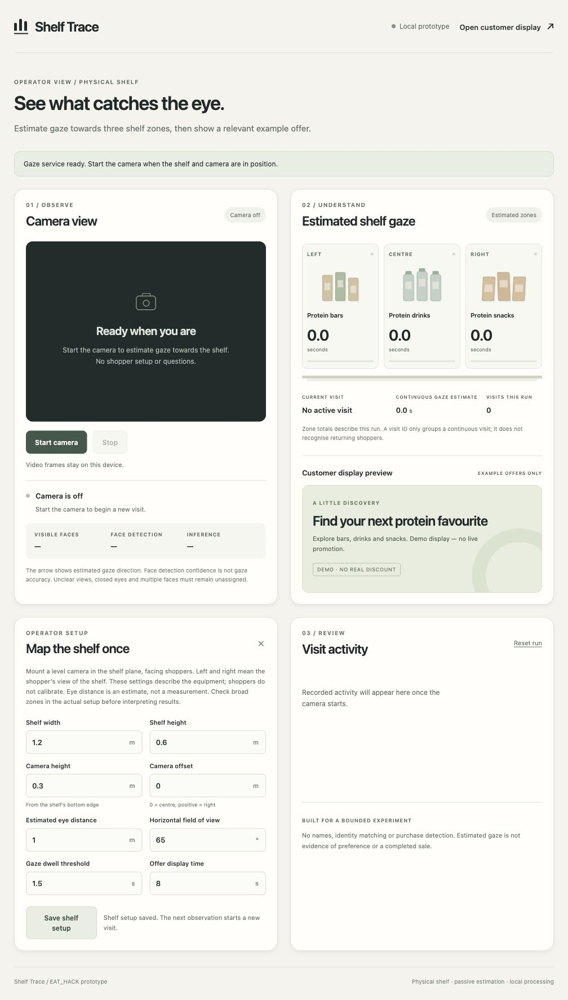

# Trace audit and completion report

Reviewed on 3 October 2026. Baseline: `fb25455`. Scope: the existing local FastAPI and plain JavaScript application. The original task briefs and the separate Coding workspace were not changed.

The software review is complete. The application has passed the automated checks and the browser scenarios below. Live webcam use awaits the user's permission, and physical shelf accuracy has not been measured. Those limits prevent an unconditional product acceptance claim.

## Review scores

These are reviewer assessments of this bounded prototype, not certified standards or measured user-study results. The supplied brief's references to a "2026 standard" do not identify an external standard. Here, 9 means that the inspected views and tested paths have no remaining critical defect; 10 would require broader device, accessibility and user validation.

| Category | Baseline | Final | Basis and limit |
| --- | ---: | ---: | --- |
| Visual | 8/10 | 9/10 | Clear camera, result, setup and activity hierarchy. Final desktop and 390 px layouts inspected; offer decoration no longer covers mobile text. No formal accessibility certification or user scanning-time measurement. |
| Functional | 6/10 | 9/10 | Confirmed state, cancellation, input and lifecycle failures repaired. 68 Python and 19 JavaScript tests pass; setup, reset, restart and display recovery checked in the browser. This score excludes unperformed live-camera and physical-accuracy acceptance. |
| Trust | 7/10 | 9/10 | Estimates, temporary visits and demo offers are labelled. Errors explain recovery, stale offers clear, and a restarted service requires setup review. No claim of identity, purchases, returning-customer detection or measured gaze accuracy. |

The correction pass repaired API and client failures. Independent review then found and closed two lifecycle defects. Final responsive inspection found and corrected one decorative overlap. No known critical defect remains in the reviewed software paths.

## Visual wins and brief adaptations

The existing two-column desktop grid groups observation beside its result, then places equipment setup beside visit activity. At 390 px it becomes a single column, while the three zone cards remain comparable. Both pages have clear empty states; the operator provides a camera-start action and the customer display shows a general discovery message.

The cream, green and charcoal palette, restrained illustrations and static typography were retained. Glass effects, kinetic type and a sidebar would not resolve a demonstrated problem here. The user explicitly chose to keep the local Python/plain JavaScript stack, so Next.js, Tailwind, Framer Motion and Modal requirements from the generic briefs do not apply.

Loading states use disabled controls, busy semantics and short messages. Successful saves and resets are acknowledged after the server responds. Inline feedback suits these small local controls; speculative success, skeletons, toasts and confirmation modals were not added solely to match a checklist. A sub-100 ms response guarantee was not measured or claimed.

## Findings and corrections

| Confirmed defect | Correction | Evidence |
| --- | --- | --- |
| Invalid equipment geometry produced only a generic 422 message. | Show the field-specific validation reason and preserve entered values. | Before/after screenshots and videos below; browser save recovery; client regression. |
| Cancellation could admit a second model worker while the first still ran. | Keep admission occupied until native work finishes. | Controlled thread/cancellation regression in `tests/test_server.py`. |
| A failed old inference could mutate a reset journey. | Check generation on both success and failure, and fence delayed arrivals using instance/generation headers. | Server tests and client token-order tests. |
| Setup bodies were unbounded and JPEG dimensions were checked after decoding. | Bound streamed bytes and upload time; inspect JPEG dimensions before allocation. | Before-failing and after-passing server tests. |
| Stale samples could leave zone offers visible. | Expire offers with dwell; clear old browser estimates and timed-out customer offers. | 1,000 stale offers before, zero after; expiry and hung-poll tests. |
| Late saves and status replies could overwrite newer edits or reset state. | Keep separate input/control revisions and ignore obsolete responses. | Controlled delayed-response client tests. |
| Restarted services left the form showing old geometry. | Reload clean fields, preserve unsaved edits, stop capture and require setup confirmation. | Independent reproduction and real service restart in the browser. |
| Restoring a suspended page could resume callbacks after camera tracks stopped. | Cancel timers, abort work, invalidate capture generation and keep restored pages stopped. | Independent reproduction and lifecycle tests, including late camera permission. |
| Offer decoration covered copy at 390 px. | Place all offer text above the decorative layer. | Final mobile screenshot inspected after correction. |

Detailed root causes and ranked hypotheses are in [DEBUG.md](DEBUG.md). Error codes, deadlines and remaining native-worker limits are in [ERROR_HANDLING.md](ERROR_HANDLING.md).

## Browser verification

Checks used the Codex in-app browser and isolated loopback service on port 4322. The original version was also started separately on port 4323 solely to record its validation error. Neither session opened a camera. Desktop views were inspected at widths of 1,008 and 1,280 px; both final pages were inspected at 390 by 844 px.

| Scenario | Observed result |
| --- | --- |
| Start page with verified models | Ready banner, camera off, zero totals, general offer; Start available and Stop disabled. |
| Shelf height 0.6 m, camera height 2 m | Save rejected with "Camera height must be within the shelf height." Saved geometry remains unchanged. |
| Correct camera height to 0.3 m | Save succeeds and the activity list records setup changes. |
| Reset run | Totals and activity return to the empty state; equipment setup remains. |
| Stop the owned test service | Operator shows a reconnect message; customer display shows "Local connection paused" and a general offer. |
| Restart after saving width 2.4 m | Form reloads the server's default 1.2 m. Both restart messages explain the change; Start remains disabled until Save succeeds. Customer display reconnects. |
| Keyboard Tab from a reloaded page | Skip link receives a visible 3 px outline. Enter moves focus to `main-content`. |
| Mobile layouts | Document width equals viewport width, 390 px. Controls and offer copy are visible with no horizontal document overflow. |

The fresh customer display had no captured console warnings/errors before the intentional disconnect. Stopping the service intentionally produces network failures; those are expected evidence of the recovery test, not a claim that the browser log is empty throughout the run.

### Saved screenshots

Every image below was saved and inspected. All camera panels are off.

| Evidence | Image |
| --- | --- |
| Initial desktop | [01-before-operator.jpg](screenshots/01-before-operator.jpg) |
| Original generic validation error | [02-before-invalid-setup.jpg](screenshots/02-before-invalid-setup.jpg) |
| Initial mobile view | [03-before-mobile.jpg](screenshots/03-before-mobile.jpg) |
| Original offline state | [04-before-service-offline.jpg](screenshots/04-before-service-offline.jpg) |
| Corrected validation error | [05-after-invalid-setup.jpg](screenshots/05-after-invalid-setup.jpg) |
| Final desktop operator | [06-after-operator.jpg](screenshots/06-after-operator.jpg) |
| Final mobile operator | [07-after-mobile.jpg](screenshots/07-after-mobile.jpg) |
| Customer display | [08-after-display.jpg](screenshots/08-after-display.jpg) |
| Mobile customer display | [09-after-display-mobile.jpg](screenshots/09-after-display-mobile.jpg) |
| Customer connection loss | [10-after-display-offline.jpg](screenshots/10-after-display-offline.jpg) |
| Restart requires setup review | [11-after-service-restart.jpg](screenshots/11-after-service-restart.jpg) |
| Keyboard focus | [12-after-keyboard-focus.jpg](screenshots/12-after-keyboard-focus.jpg) |
| Handoff overview | [13-after-overview.jpg](screenshots/13-after-overview.jpg) |

### Browser recordings

- [Before: generic setup error](videos/before-setup-validation.mp4), 7.8 seconds, 1,280 by 900.
- [After: specific error and successful correction](videos/after-setup-validation.mp4), 9.13 seconds, 1,280 by 720.

These are actual browser screencast frames captured during the interactions, encoded as silent H.264 MP4 files. Capture is sparse and event-driven, with a final still held for readability; it is not a frame-rate or latency measurement. Both files decoded without errors and their resulting error/success frames were inspected. There is no camera footage, narration or fabricated inference. These debugging clips are not the EAT_HACK working-product submission video.

## Automated and model verification

| Check | Result |
| --- | --- |
| `.venv/bin/python -m pytest -q` | 68 passed. One upstream Starlette TestClient deprecation warning remains. |
| `node --test tests/*.mjs` | 19 passed; no failures, skips or cancellations. |
| JavaScript syntax and Python compilation | Passed for changed scripts and relevant Python modules. |
| Pinned model verification | All nine files across five models verified; 18,685,381 bytes. |
| Synthetic stale-offer sweep | 1,000 failures before, zero after for the sampled expiry interval. |
| Real-model publisher-image profile | Roughly 7 ms median on this machine and this one input; see [PERFORMANCE.md](PERFORMANCE.md). |

The independent reviewer re-ran both restart and page-restoration reproductions after the fixes. The backend and documentation received a separate consistency review. These checks do not establish physical gaze accuracy, a sustained-load guarantee or broad browser compatibility.

## Remaining acceptance work

Live webcam testing awaits the user's permission. After that, the physical installation still needs measured shelf targets, known distances and labelled trials covering lighting, glasses, occlusion and off-axis positions. The evaluation protocol is in [RESEARCH.md](RESEARCH.md).

A webcam smoke check alone cannot validate product-level gaze, pickups, purchases, returning customers or shopper intent. Those features are outside the current implementation. No raw camera frames, biometric templates or participant recordings are included in this review.

The broader "Verified & Polished" product gate remains conditional on those unperformed physical checks. The delivered result is a completed software review with explicit acceptance limits.
